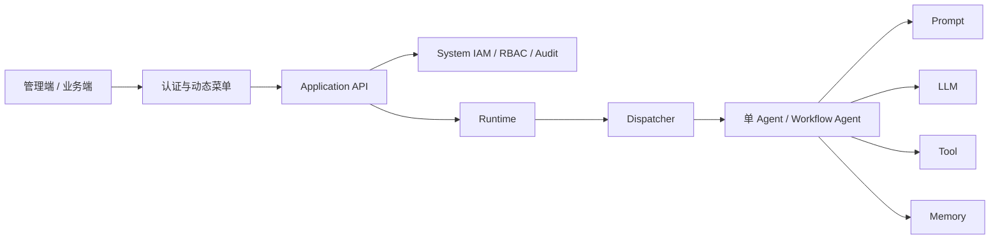
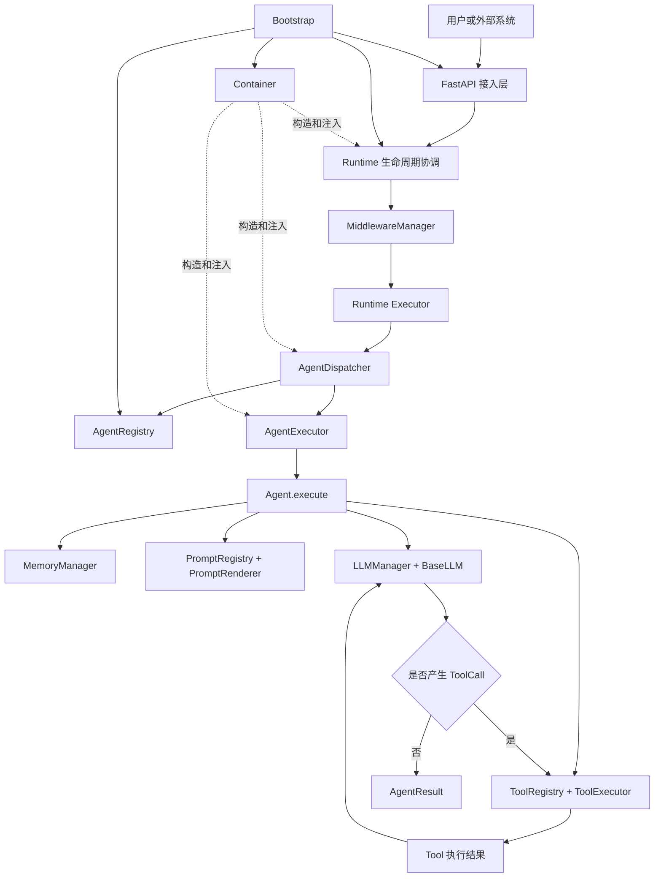
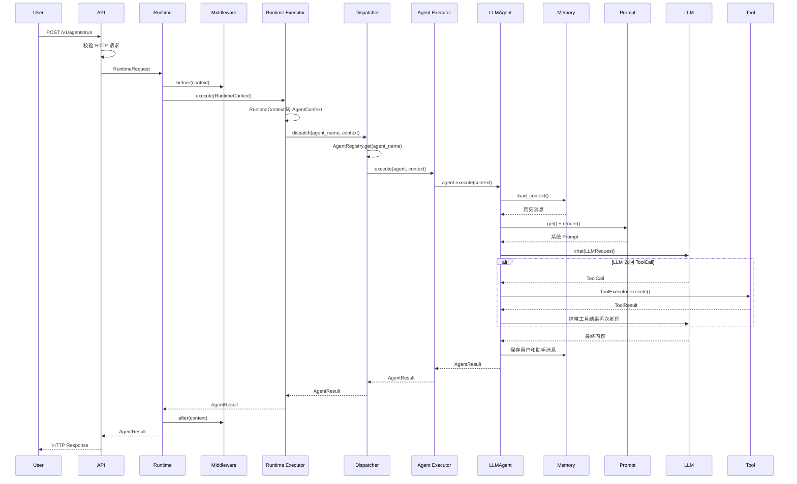
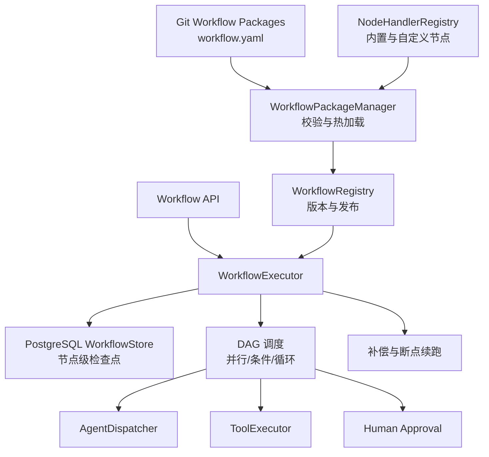
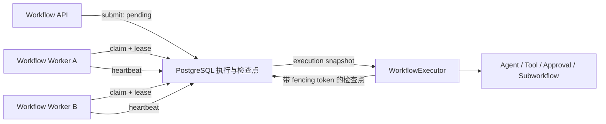
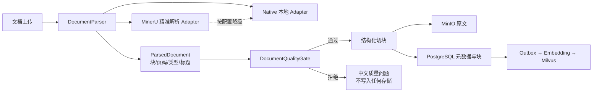

# Enterprise AI Platform 架构设计与 Agent 开发指南

## 1. 文档目的

本文档用于说明当前 Enterprise AI Platform 的整体架构、核心模块职责、
请求执行过程，以及如何基于现有框架开发新的 Agent、Prompt 和 Tool。

平台当前的核心目标是：

- 提供统一的 Agent 请求生命周期；
- 隔离 API、运行时、Agent 业务和模型供应商；
- 通过 Container 管理依赖，通过 Registry 管理业务组件；
- 让 Memory、Prompt、LLM、Tool 能够按需组合；
- 为后续 Workflow、RAG、MCP 和 Multi-Agent 保留扩展边界。
- 提供若依式系统管理控制面，并让业务模块与平台治理模块分区扩展。

当前管理面由 `app/system` 和 `web` 组成：

- `app/system`：用户、角色、菜单、权限、令牌、租户边界和操作日志；
- `web`：登录、动态菜单、系统管理、AI 资产、任务追踪、审批和业务页面；
- 管理面只通过 Application API 操作平台，不绕过 Runtime 直接运行 Agent。



当前架构遵循以下原则：

1. Runtime 负责执行生命周期，不负责业务推理；
2. Agent 负责业务能力编排；
3. Memory、Prompt、LLM、Tool 彼此独立；
4. Container 按类型构造对象；
5. Registry 按业务名称查找组件；
6. Bootstrap 是唯一系统组装入口；
7. API 只负责协议适配，不直接调用 Agent 或 LLM。

---

## 2. 整体架构



平台分为四个逻辑层次。

### 2.1 接入层

由 `app/bootstrap/application.py` 中的 FastAPI Application 承担。

职责：

- 接收和校验 HTTP 请求；
- 将 HTTP 请求转换为 `RuntimeRequest`；
- 为每次请求创建 Container Scope；
- 调用 Runtime；
- 将 `AgentResult` 转换为 HTTP 响应；
- 将平台错误码转换为对应 HTTP 状态码。

接入层不应：

- 在业务执行路径中直接查询 AgentRegistry；
- 直接调用 Agent；
- 直接调用 LLM 或 Tool；
- 实现业务逻辑。

健康检查和管理类接口可以只读查询 Registry，用于展示当前已注册组件。

### 2.2 运行时编排层

由 Runtime、Middleware、Runtime Executor、Dispatcher 和 Agent Executor 组成。

这一层负责一次 Agent 请求从开始到结束的完整生命周期，但不决定具体业务逻辑。

### 2.3 Agent 能力层

Agent 是业务编排中心。平台提供默认 `LLMAgent`，也允许业务继承
`BaseAgent` 实现完全自定义的执行逻辑。

Agent 可以组合：

- Memory：加载和保存上下文；
- Prompt：管理系统提示词和模板变量；
- LLM：完成模型推理；
- Tool：调用外部业务能力。

这些模块不是固定的线性依赖关系。实际控制者始终是 Agent。

### 2.4 基础设施层

包括：

- Container：依赖注入和对象生命周期；
- Registry：业务组件注册和查询；
- Bootstrap：配置加载、实例创建和系统启动；
- Protocol：统一消息、工具调用和响应数据结构；
- Exceptions：统一平台错误码。

---

## 3. 一次请求的完整执行过程



### 3.1 请求对象转换

各层不共享同一个万能对象，而是在明确边界转换：

```text
HTTP AgentRunRequest
    ↓ Application
RuntimeRequest
    ↓ Runtime Executor
AgentContext
    ↓ LLMAgent
LLMRequest
```

这样可以避免 API、Agent 和具体模型供应商互相耦合。

### 3.2 Runtime 状态

`RuntimeContext` 维护一次请求的生命周期状态：

```text
CREATED
  → PREPARING
  → RUNNING
  → COMPLETED

任意执行阶段
  → FAILED
  → CANCELLED
  → TIMEOUT
```

RuntimeContext 还保存：

- request/trace ID；
- 目标 Agent；
- 请求状态；
- 开始时间和耗时；
- AgentContext 等过程数据；
- 最终响应；
- 执行异常。

### 3.3 Middleware 执行规则

中间件契约：

```python
async def before(context: RuntimeContext) -> None:
    ...

async def after(context: RuntimeContext) -> None:
    ...

async def on_error(
    context: RuntimeContext,
    error: Exception,
) -> None:
    ...
```

执行顺序：

```text
before:   Middleware A → B → C
after:    Middleware C → B → A
on_error: Middleware C → B → A
```

只有成功完成 `before()` 的中间件才会进入对应的 `after()` 或
`on_error()`。

适合使用 Middleware 实现：

- 身份和租户上下文校验；
- 请求日志；
- Trace 和 Metrics；
- 限流；
- 审计；
- 请求级超时；
- 内容安全检查。

不要在 Middleware 中实现 Agent 业务逻辑。

---

## 4. 核心模块职责

## 4.1 Runtime

目录：`app/runtime`

| 文件 | 职责 |
|---|---|
| `request.py` | Runtime 统一输入 |
| `context.py` | 请求生命周期状态和过程数据 |
| `middleware.py` | 横切逻辑管线 |
| `executor.py` | RuntimeContext 到 AgentContext 的转换 |
| `dispatcher.py` | 按名称查找并分发 Agent |
| `runtime.py` | 整体生命周期协调和异常收口 |
| `event_bus.py` | 异步事件发布和订阅基础能力 |
| `trace.py` | Trace 和 Span 数据结构 |
| `stream.py` | 流式事件转发基础能力 |

Runtime 不应该直接实现：

- Prompt 渲染；
- Memory 读写；
- LLM 推理；
- Tool 调用；
- 业务决策。

## 4.2 Agent

目录：`app/agent`

核心对象：

- `AgentConfig`：声明 Agent 名称及其能力配置；
- `AgentContext`：一次 Agent 执行的输入和请求数据；
- `AgentResult`：统一 Agent 输出；
- `BaseAgent`：自定义 Agent 抽象接口；
- `LLMAgent`：平台默认 Memory/Prompt/LLM/Tool 编排实现；
- `AgentRegistry`：按名称管理 Agent；
- `AgentExecutor`：执行、计时和异常边界。

AgentConfig 中的重要配置：

```python
AgentConfig(
    name="customer-service",
    description="Customer service Agent",
    prompt_name="customer-service-system",
    llm_name="primary-model",
    tools=["query_order", "create_ticket"],
    memory_enabled=True,
    metadata={
        "history_limit": 20,
        "max_iterations": 5,
    },
)
```

## 4.3 Prompt

目录：`app/prompt`

支持：

- 按名称和版本注册 Prompt；
- 必填变量校验；
- 默认变量；
- 模板渲染；
- Registry 冻结。

`get(name)` 返回该名称最后注册的版本，也可以使用
`get(name, version)` 获取指定版本。

## 4.4 LLM

目录：`app/llm`

核心抽象：

```python
class BaseLLM:
    async def chat(
        self,
        request: LLMRequest,
    ) -> LLMResponse:
        ...

    async def stream(
        self,
        request: LLMRequest,
    ) -> AsyncIterator[StreamChunk]:
        ...
```

平台当前提供 `OpenAICompatibleLLM`，可以用于 OpenAI 或兼容
Chat Completions 协议的服务。

LLMManager 负责：

- 注册多个 Provider；
- 设置默认模型；
- 按模型名称查询；
- 防止重复注册；
- 启动后冻结。

LLM 层负责供应商协议转换，不负责业务 Prompt 或 Memory。

## 4.5 Tool

目录：`app/tool`

一个 Tool 包含：

- 唯一名称；
- 参数 Schema；
- 超时时间；
- 异步执行方法；
- 标准 ToolResult。

ToolExecutor 统一处理：

- 必填参数；
- 默认值；
- 参数类型；
- 未知参数；
- 超时；
- 执行计时；
- 平台异常转换。

LLMAgent 只允许调用 AgentConfig.tools 白名单中的工具。

## 4.6 Memory

目录：`app/memory`

Memory 分为：

- 原始会话消息：用于历史查看和审计，只按 TTL 清理；
- Conversation 上下文投影：保存摘要、消息数量和最近消息预览；
- 长期 MemoryItem：保存稳定事实、偏好及其治理元数据。

LLM 每次只接收“会话摘要 + 最近 `history_limit` 条消息”，上下文压缩
不会删除原始消息。摘要通过 `BaseMemorySummarizer` seam 切换：

- `ExtractiveMemorySummarizer` 是无模型依赖的稳定降级实现；
- `LLMMemorySummarizer` 生成语义摘要，失败时自动回退；
- `memory_summary_model` 决定是否启用专用摘要模型。

Memory 通过 `BaseMemoryStore` 抽象切换后端：

- `InMemoryStore` 用于单元测试和轻量本地开发；
- `PostgreSQLMemoryStore` 用于当前企业部署，按 tenant、user、
  agent namespace 隔离并持久化；
- `ProtectedMemoryStore` 在存储前执行敏感信息脱敏；
- `VectorSemanticMemoryStore` 将记忆正文保存在 PostgreSQL，将 BGE-M3
  向量保存在 Milvus `agent_memory_vectors`，Milvus 不可用时降级为
  PostgreSQL 文本检索。

长期记忆使用稳定 Key 治理：相同内容再次写入会增加强化次数；同 Key
内容变化会更新当前值并保留有限修订历史；低于
`memory_minimum_confidence` 的候选不会入库。每条记忆记录来源、置信度、
创建时间、更新时间和向量索引状态。

## 4.7 配置、治理与运行数据持久化

PostgreSQL 是当前平台事实数据源，Alembic 负责版本化迁移：

- 模型 Profile、Prompt、Tool、Agent 的定义、版本和发布状态；
- Agent 评测报告、发布记录和回滚激活状态；
- Runtime Task、Task Event 和 Trace Span；
- LLM 调用 Token、租户、模型与成本结算明细；
- 用户、角色、权限、菜单和操作日志；
- 长期记忆及语义检索元数据。

启动顺序为：

```text
SystemDatabase 校验
  → 各配置服务导入 Bootstrap 初始数据
  → RegistryLoader 按 Model → Prompt → Tool → Agent 恢复
  → Agent 治理与 LLM 当日用量恢复
  → Runtime 对外接收请求
```

Python Tool 只从 `tool_python_discovery_packages` 声明的部署可信包中
扫描，并形成只读候选目录；管理端只能选择候选项，数据库配置不能触发
任意 Python 模块加载。

### Milvus 与知识库

平台使用统一 `BaseVectorStore` 抽象，当前生产实现为 Milvus：

```text
PostgreSQL（Memory/Knowledge事实数据）
  ├── Knowledge → Vector Outbox → Embedding Worker → Milvus
  └── Memory → BGE-M3 Embedding → Milvus
      ├── agent_memory_vectors
      └── knowledge_vectors
```

- 两个 Collection 均为 BGE-M3 对应的 1024 维；
- 使用 COSINE 距离和 HNSW 索引；
- `tenant_id` 是显式 Partition Key，查询和删除强制租户过滤；
- Memory 向量写入记录 `pending/indexed/failed` 状态，检索异常自动降级；
- 启动时自动建库、建 Collection，并拒绝维度或必需字段不匹配；
- 知识库、文档和切片保存在 PostgreSQL，Milvus 不是业务事实源；
- Outbox 支持多 Worker `SKIP LOCKED`、指数退避和死信状态。

当前尚未启用 Outbox 消费器：必须先配置可调用的 BGE-M3 推理服务，
否则平台只会可靠记录待索引事件，不会伪造或写入空向量。

## 4.8 Container

目录：`app/core/container`

Container 支持：

- Singleton：全局单例；
- Transient：每次创建；
- Scoped：每个请求作用域一个实例；
- 构造器类型注解注入；
- 接口绑定；
- 循环依赖检测。

使用示例：

```python
container.register(AgentExecutor)
container.register(AgentDispatcher)
container.register(Executor)
container.register(MiddlewareManager)
container.register(Runtime)

runtime = container.get(Runtime)
```

请求作用域：

```python
with container.scope():
    result = await runtime.run(request)
```

Container 不用于通过业务名称查找 Agent 或 Tool，这属于 Registry。

## 4.9 Registry

Registry 负责业务组件管理：

```text
AgentRegistry  Agent名称 → Agent实例
PromptRegistry Prompt名称和版本 → PromptTemplate
LLMManager     模型名称 → BaseLLM
ToolRegistry   Tool名称 → BaseTool
```

约束：

- 默认禁止重复注册；
- 替换必须显式调用 `replace()`；
- Bootstrap 组装完成后冻结；
- 运行期间不能随意修改组件集合。

## 4.10 Bootstrap

目录：`app/bootstrap`

Bootstrap 是唯一组装入口：

1. 加载环境配置；
2. 初始化日志；
3. 创建 Container；
4. 创建并填充 Registry；
5. 注册 Prompt、LLM、Tool 和 Agent；
6. 冻结 Registry；
7. 通过 Container 构造 Runtime；
8. 创建 Application 和 FastAPI；
9. 启动 Uvicorn。

`Bootstrap.build()` 只组装、不启动服务器，适合测试和外部 ASGI
托管；`Bootstrap.run()` 会组装并启动 Uvicorn。

---

## 5. 开始 Agent 开发

当前生产开发以文件包为事实源：`agents/` 保存 Agent，`workflows/` 保存固定编排，
`applications/` 保存用户入口。管理台创建的文件资源和开发者手写资源遵守同一目录协议。

> 本节中的 Python 对象示例用于解释底层接口和单元测试。正式业务不要在根目录
> `run.py` 中逐个注入 Prompt、Tool 或 Agent。

## 5.1 路径一：配置平台 LLMAgent

适用于绝大多数：

- 客服 Agent；
- 办公助手；
- 查询型 Agent；
- Tool Calling Agent；
- 轻量 RAG Agent。

正式开发只需要：

1. 创建 `agents/<package>/agent.yaml`；
2. 在 `prompts/` 创建 Prompt YAML 与 Jinja2；
3. 在可信业务包或 Agent 的 `tools/` 中开发 Tool；
4. 在管理台重新加载、评测并发布；
5. 需要独立入口时创建 `applications/<name>/application.yaml`。

LLMAgent 已经处理：

- 历史消息加载；
- Prompt 渲染；
- LLM 调用；
- Tool 循环；
- 最大迭代限制；
- Token Usage 聚合；
- 会话消息保存。

### 第一步：定义 Prompt

```python
from app.prompt import (
    PromptTemplate,
    PromptVariable,
)

customer_service_prompt = PromptTemplate(
    name="customer-service-system",
    version="1.0",
    description="Customer service system prompt",
    template=(
        "You are a customer service assistant for {company}. "
        "Use tools to verify business data before answering."
    ),
    variables=[
        PromptVariable(
            name="company",
            default="Example Corporation",
        )
    ],
)
```

注意：当前 LLMAgent 会把 `AgentContext.variables`、`input` 和
`user_input` 传给 PromptRenderer。API 中的 `parameters` 会进入
`AgentContext.variables`。

### 第二步：定义 Tool

```python
from app.tool import (
    BaseTool,
    ToolParameter,
    ToolResult,
    ToolSchema,
)


class QueryOrderTool(BaseTool):
    name = "query_order"
    timeout = 10.0

    def schema(self) -> ToolSchema:
        return ToolSchema(
            name=self.name,
            description="Query an order by order number.",
            parameters=[
                ToolParameter(
                    name="order_id",
                    type="string",
                    description="Order number",
                    required=True,
                )
            ],
        )

    async def run(
        self,
        params: dict,
    ) -> ToolResult:
        order_id = params["order_id"]

        # 在这里调用真实订单服务。
        order = {
            "order_id": order_id,
            "status": "shipped",
        }

        return ToolResult(
            success=True,
            data=order,
        )
```

Tool 开发约束：

- `run()` 必须是异步方法；
- 必须返回 `ToolResult`；
- 不要在 Tool 内捕获并隐藏程序异常；
- 对外部系统调用设置合理 `timeout`；
- Tool 不应直接调用 Agent 或 Runtime；
- 敏感写操作应在 Tool 内完成权限校验或审批。

### 第三步：创建 LLMAgent

```python
from app.agent import AgentConfig, LLMAgent


agent = LLMAgent(
    config=AgentConfig(
        name="customer-service",
        description="Enterprise customer service Agent",
        prompt_name="customer-service-system",
        llm_name="primary-model",
        tools=["query_order"],
        memory_enabled=True,
        metadata={
            "history_limit": 20,
            "max_iterations": 5,
        },
    ),
    memory_manager=memory_manager,
    prompt_registry=prompt_registry,
    prompt_renderer=prompt_renderer,
    llm_manager=llm_manager,
    tool_registry=tool_registry,
    tool_executor=tool_executor,
)
```

实际项目中，这些依赖应由 Bootstrap 和 Container 提供，不要在 API
请求处理函数中临时创建。

### 第四步：通过文件包自动发现

正式 Agent 使用下面的声明文件，由 AgentPackageManager 扫描并构建运行时快照：

```yaml
schema_version: 1
name: customer-service
description: 企业客服 Agent
model:
  profile: primary-model
prompt:
  ref: prompts/customer-service-system.yaml
tools: [query_order]
memory:
  enabled: true
knowledge:
  base_ids: []
  limit: 5
```

下面的 Bootstrap 注入仅保留给隔离实验、底层接口测试或宿主程序显式嵌入平台，
不是当前业务开发主路径。

当前 Bootstrap 支持构建期注入 Prompt、Tool 和 Agent：

```python
bootstrap = Bootstrap({
    "prompts": [
        customer_service_prompt,
    ],
    "tools": [
        QueryOrderTool(),
    ],
    "llm_agents": [
        AgentConfig(
            name="customer-service",
            prompt_name="customer-service-system",
            llm_name="primary-model",
            tools=["query_order"],
            memory_enabled=True,
        ),
    ],
})

application = bootstrap.build(
    llm=primary_llm,
)
```

Registry 会在组装结束后冻结。因此所有静态组件必须在
`Bootstrap.build()` 完成之前注册。

`llm_agents` 接收 `AgentConfig`。Bootstrap 会校验其中引用的 Prompt、
LLM 和 Tool，并使用平台内部的 MemoryManager、PromptRegistry、
LLMManager、ToolRegistry 和 ToolExecutor 创建 LLMAgent。业务代码不需要
自行取得这些基础设施依赖。

如果只需要配置默认 Agent 的工具，可以使用：

```python
bootstrap = Bootstrap({
    "tools": [
        QueryOrderTool(),
    ],
    "default_tools": [
        "query_order",
    ],
    "agent_metadata": {
        "history_limit": 20,
        "max_iterations": 5,
    },
})
```

## 5.2 路径二：开发自定义 BaseAgent

适用于：

- Text2SQL；
- 确定性业务流程；
- 复杂 RAG；
- 多阶段审核；
- 非 LLM Agent；
- 需要自定义状态机的 Agent。

```python
from app.agent import (
    AgentConfig,
    AgentContext,
    AgentResult,
    BaseAgent,
)


class Text2SQLAgent(BaseAgent):
    def __init__(
        self,
        config: AgentConfig,
        llm_manager,
        schema_service,
        sql_validator,
        database_tool,
    ):
        super().__init__(config)
        self.llm_manager = llm_manager
        self.schema_service = schema_service
        self.sql_validator = sql_validator
        self.database_tool = database_tool

    async def execute(
        self,
        context: AgentContext,
    ) -> AgentResult:
        # 1. 获取数据库Schema
        # 2. 构建Prompt
        # 3. 调用LLM生成SQL
        # 4. 校验SQL
        # 5. 执行只读查询
        # 6. 返回结果
        return AgentResult(
            success=True,
            content="...",
        )
```

自定义 Agent 约束：

- 实现 `execute(context)`；
- 返回 `AgentResult`；
- 不自行处理 Runtime 生命周期；
- 不直接访问全局 Container；
- 长期依赖通过构造函数注入；
- 请求数据通过 AgentContext 获取；
- 不绕过 ToolExecutor 直接执行已注册工具；
- 不捕获并隐藏平台异常。

---

## 6. 调用 Agent API

### 6.1 模型配置文件

平台默认读取根目录的 `config.yaml`，模型通过逻辑名称管理：

```yaml
default_model: dashscope-reasoning

models:
  dashscope-reasoning:
    provider: openai_compatible
    model: qwen3.6-plus-2026-04-02
    api_key_env: DASHSCOPE_API_KEY
    base_url: https://dashscope.aliyuncs.com/compatible-mode/v1
    temperature: 0.2
    max_tokens: 4000
```

本地测试使用不提交的 `config.test.yaml`：

```yaml
models:
  dashscope-reasoning:
    api_key: "你的新API Key"
```

`config.test.yaml` 已被加入 `.gitignore`。生产环境更建议使用环境变量或
Secret Manager，避免明文密钥进入文件系统。

AgentConfig 只引用逻辑模型名：

```python
AgentConfig(
    name="contract-agent",
    llm_name="dashscope-reasoning",
)
```

Bootstrap 会将逻辑模型名解析为对应的 Provider 和真实模型 ID。

Bootstrap 的完整字段、类型、默认值和密钥配置方式见
[CONFIGURATION.md](CONFIGURATION.md)。

启动：

```powershell
$env:EAP_OPENAI_API_KEY = "your-api-key"
$env:EAP_MODEL = "your-model"
$env:EAP_OPENAI_BASE_URL = "https://api.openai.com/v1"

python run.py
```

可选环境变量：

| 环境变量 | 默认值 | 作用 |
|---|---|---|
| `EAP_HOST` | `0.0.0.0` | HTTP监听地址 |
| `EAP_PORT` | `8000` | HTTP端口 |
| `EAP_LOG_LEVEL` | `INFO` | 日志级别 |
| `EAP_OPENAI_API_KEY` | 无 | OpenAI兼容服务密钥 |
| `EAP_OPENAI_BASE_URL` | SDK默认值 | 兼容服务地址 |
| `EAP_MODEL` | 无 | 默认模型名称 |
| `EAP_DEFAULT_AGENT` | `default` | 默认Agent名称 |

健康检查：

```bash
curl http://localhost:8000/health
```

执行 Agent：

```bash
curl -X POST http://localhost:8000/v1/agents/run \
  -H "Content-Type: application/json" \
  -d '{
    "message": "查询订单 A1001",
    "agent": "default",
    "session_id": "session-001",
    "user_id": "user-001",
    "parameters": {
      "company": "Example Corporation"
    },
    "metadata": {
      "tenant_id": "tenant-001"
    }
  }'
```

响应结构：

```json
{
  "success": true,
  "content": "订单已经发货。",
  "tool_calls": [
    {
      "id": "call-001",
      "name": "query_order",
      "arguments": {
        "order_id": "A1001"
      },
      "result": {
        "status": "shipped"
      },
      "finished": true
    }
  ],
  "metadata": {
    "model": "your-model",
    "finish_reason": "stop",
    "usage": {
      "prompt_tokens": 100,
      "completion_tokens": 20,
      "total_tokens": 120
    }
  },
  "error": null,
  "elapsed": 0.82
}
```

---

## 7. 错误处理

错误传播路径：

```text
底层模块抛出 PlatformError
  → AgentExecutor 保留平台异常
  → Runtime 更新失败状态并调用 on_error
  → AgentResult.metadata.error_code
  → Application 映射 HTTP 状态
```

部分错误映射：

| 错误 | HTTP状态 |
|---|---:|
| Agent或Tool不存在 | 404 |
| Tool参数错误 | 422 |
| LLM限流 | 429 |
| LLM Provider错误 | 502 |
| Tool或LLM超时 | 504 |
| 未分类程序错误 | 500 |

业务失败与程序异常应区分：

- Tool 正常执行但业务拒绝：返回 `ToolResult(success=False)`；
- 参数错误、超时、连接失败或程序 Bug：抛出平台异常。

---

## 8. 测试建议

Agent 开发至少覆盖以下测试。

### 8.1 Tool 单元测试

- 正常参数；
- 缺失参数；
- 错误参数类型；
- 未知参数；
- 超时；
- 外部服务异常；
- 业务失败结果。

### 8.2 Agent 单元测试

使用 FakeLLM，不调用真实模型：

- LLM 直接返回最终内容；
- LLM 发起允许的 ToolCall；
- LLM 发起未授权 ToolCall；
- Tool 返回业务失败；
- 超过最大迭代次数；
- Memory 开启和关闭；
- Prompt 变量缺失；
- Token Usage 聚合。

### 8.3 Runtime 集成测试

- Middleware 顺序；
- Agent 不存在；
- Agent 程序异常；
- Runtime 状态转换；
- 用户和租户 Memory 隔离；
- Container Scope 隔离。

### 8.4 API 测试

建议使用 HTTPX ASGI Transport，直接测试 FastAPI 应用：

```python
transport = httpx.ASGITransport(
    app=application.get_fastapi(),
)

async with httpx.AsyncClient(
    transport=transport,
    base_url="http://test",
) as client:
    response = await client.post(
        "/v1/agents/run",
        json={
            "message": "hello",
            "agent": "default",
        },
    )
```

---

## 9. Agent 开发检查清单

开发前：

- [ ] 明确 Agent 的输入、输出和业务边界；
- [ ] 判断使用 LLMAgent 还是自定义 BaseAgent；
- [ ] 定义 Prompt 名称和版本；
- [ ] 确定允许调用的 Tool 白名单；
- [ ] 确定是否启用 Memory；
- [ ] 确定租户和用户隔离方式；
- [ ] 设置最大工具迭代次数；
- [ ] 设置 Tool 超时。

开发中：

- [ ] 不在 API 中实现业务逻辑；
- [ ] 不从业务代码中直接调用 Container；
- [ ] 不让 Tool 调用 Runtime 或 Agent；
- [ ] 不在 Prompt 中嵌入密钥；
- [ ] 不让模型自行决定未注册工具；
- [ ] 不捕获并隐藏平台异常；
- [ ] 对写操作执行权限检查；
- [ ] 对模型输出进行业务校验。

上线前：

- [ ] 使用持久化 MemoryStore；
- [ ] 接入认证和租户校验；
- [ ] 接入 Secret Manager；
- [ ] 接入 Trace、Metrics 和审计日志；
- [ ] 增加限流、重试和熔断；
- [ ] 完成工具权限审查；
- [ ] 完成 Prompt 版本回归测试；
- [ ] 完成成本和 Token 预算测试。

---

## 10. 当前边界和后续扩展

当前已经具备可运行的核心 Agent 平台闭环，但以下能力仍属于后续阶段：

- 持久化 Memory；
- SSE/WebSocket 流式 API；
- Trace 和 Metrics 后端导出；
- 身份认证、RBAC 和租户认证；
- Secret Manager；
- Provider 重试、熔断和并发限制；
- Workflow；
- Knowledge/RAG；
- MCP；
- Multi-Agent；
- Evaluation；
- Scheduler。

扩展这些能力时应继续保持：

```text
API负责接入
Runtime负责生命周期
Agent负责编排
能力模块负责实现
Container负责构造
Registry负责管理
Bootstrap负责组装
```

不要为了新增能力绕过 Runtime，也不要把所有能力塞入一个万能 Agent 或
万能 Container。
# 任务中心与执行追踪

平台同时支持同步Agent调用和后台任务：

```text
POST /v1/agents/run                 同步执行
POST /v1/tasks                      后台提交
GET  /v1/tasks                      最近任务列表
GET  /v1/tasks/{task_id}            任务状态
GET  /v1/tasks/{task_id}/events     生命周期事件
GET  /v1/tasks/{task_id}/trace      Span调用链
POST /v1/tasks/{task_id}/cancel     取消真实执行协程
POST /v1/tasks/{task_id}/retry      按原请求创建重试任务
```

任务状态机为：

```text
QUEUED → RUNNING → COMPLETED
                 → FAILED
                 → CANCELLED
                 → TIMEOUT
```

`runtime_timeout_seconds` 控制一次任务的总执行时间，
`task_max_retries` 控制失败、取消或超时任务允许再次提交的次数。
每次重试都会创建新的 `task_id`，并通过 `retry_of` 关联原任务。

# Memory隔离与持久化

LLMAgent使用以下四级键隔离会话记忆：

```text
tenant_id + user_id + agent_id + session_id
```

前三个维度编码为稳定namespace，`session_id`作为会话键。任意一个维度变化，
都不会读取到其他范围的消息。Memory Store可通过配置选择：

```yaml
memory_backend: sqlite
memory_sqlite_path: data/memory.db
memory_message_ttl_seconds: 2592000
memory_long_term_ttl_seconds: null
```

`in_memory`适合单元测试；`sqlite`支持单机部署下的进程重启持久化。
消息和长期记忆都带有`expires_at`，Store读取时自动过滤过期数据。

# 安全与可信租户上下文

API接入层先认证API Key并创建不可由请求体伪造的`Principal`：

```text
API Key
  → SecurityManager
  → Principal
      ├── tenant_id
      ├── user_id
      ├── roles
      ├── allowed_agents
      ├── allowed_tools
      └── allowed_models
  → RuntimeRequest
```

启用安全后，Agent、模型和Tool权限在请求进入Runtime前统一检查。
任务查询、事件、Trace、取消和重试接口同时执行租户隔离；
只有`platform_admin`角色可以跨租户访问任务。

认证支持API Key与HS256 JWT。JWT验证签名、有效期、启用时间、签发方和受众。
主体级令牌桶在认证后、Runtime执行前限流，超限返回`429`和`Retry-After`。

所有`/v1`请求由审计中间件记录动作、结果、主体、租户、资源、状态码和耗时。
审计数据写入前递归脱敏API Key、Authorization、Token、Secret和密码字段。
测试环境可使用并发安全的内存审计Adapter；生产环境由Bootstrap强制选择
PostgreSQL只追加审计Adapter，记录跨进程重启保留，并按租户和时间建立检索索引。
模型Key、API Principal Key和JWT Secret统一通过`SecretManager`解析；
当前内置环境变量Provider，Vault/KMS可实现`BaseSecretProvider`后接入。

知识库上传采用持久化异步状态机：API只负责将原文件保存到MinIO并在
PostgreSQL登记`pending`文档；解析Worker通过`FOR UPDATE SKIP LOCKED`
租用任务，执行MinerU/本地解析、质量门禁和切块。异常按指数退避重试，
Worker宕机后由租约超时自动恢复；切块与Milvus写入继续通过Vector Outbox
解耦，因此HTTP请求无需等待解析、Embedding或向量索引完成。
单文件在管理端通过预签名PUT直接上传MinIO，平台Secret Key不会下发浏览器；
提交解析前由服务端重新读取对象元数据并校验租户、知识库归属、状态和真实
文件大小。批量上传保留兼容接口并逐文件惰性处理。

# LLM调用韧性

每个模型Profile在Bootstrap阶段被组装为：

```text
逻辑模型名
  → ResilientLLM
      → OpenAICompatibleLLM
          → 模型供应商
```

`ResilientLLM`提供单次调用超时、瞬时错误重试、指数退避和状态熔断。
熔断器包含`closed`、`open`和`half_open`三种状态，恢复窗口到期后只允许
一个半开探测请求。Provider恢复则关闭熔断，探测失败则重新打开。
流式调用在首块输出后不进行重试，避免下游收到重复文本。

`RoutingLLM`将多个已治理Provider组合为一个逻辑模型，支持固定优先级
故障转移和轮询负载均衡。`LLMManager.health()`聚合Provider熔断状态，
Application通过`/health.model_health`暴露被动健康快照，不产生额外推理成本。

完整模型包装链为：

```text
StructuredOutputLLM
  → MeteredLLM
      → ResilientLLM
          → Provider
```

`MeteredLLM`按租户预留每日Token额度并用实际usage结算成本；
`GET /v1/llm/usage`提供租户隔离的用量查询。Structured Output将Agent声明的
JSON Schema传给Provider，并在返回后再次解析校验。流式响应会合并Tool Call
参数分片，并在结束块携带完整调用、finish reason和Token usage。

`LLMManager`同时管理Chat、Embedding与Rerank能力。多模态不建立另一套模型
接口，而是让`ChatMessage.content`支持标准Content Part列表，因此文本与图像
仍共享同一条治理、鉴权、路由和观测链路。

# Tool企业治理

所有本地、沙箱和远程Tool共享一条执行边界：

```text
ToolExecutor
  → 主体白名单、租户、角色校验
  → Draft 2020-12 JSON Schema校验
  → 高风险审批校验
  → 幂等缓存
  → 熔断、超时、重试
  → 本地Tool / SandboxedTool / RemoteHTTPTool
  → 结果大小校验
  → Trace、Event和脱敏Audit
```

`ToolPolicy`是工具治理契约，默认保持旧工具兼容。高风险审批绑定租户、工具和
参数SHA-256摘要，批准只能消费一次。`SandboxedTool`通过`SandboxContext`
获得受控HTTP、文件和子进程能力；网络域名、读写根路径和可执行文件必须显式
列入白名单。`RemoteHTTPTool`本身也是SandboxedTool，因此远程调用不会绕过
网络策略或其他Tool治理。

# Prompt治理

`PromptRegistry`同时承担版本索引和轻量控制面状态：

```text
Draft → Published → Retired
           ↓
       Traffic Rules
       ├── 100%固定版本
       └── 多版本灰度/A-B
```

每次发布、下线、回滚和流量变更都会写入Prompt变更记录。运行时若未固定
`AgentConfig.prompt_version`，Registry使用稳定路由键做加权选择，保证同一
请求不会随机漂移。`PromptRenderer`在格式化前执行变量JSON Schema和注入
检测，格式化后估算Token；`PromptEvaluator`可在不调用真实LLM的情况下运行
包含文本断言和Token预算的回归测试集。

# MCP与A2A

MCP采用已发布的`2025-11-25`协议：

```text
MCPServerRegistry
  → MCPClientManager
      → StdioTransport / StreamableHTTPTransport
          → initialize / initialized
          → tools/list
          → tools/call
  → MCPToolAdapter
      → ToolRegistry
      → ToolExecutor完整治理链
```

HTTP Transport处理协议版本头、可选Session ID、JSON/SSE响应和会话失效重连；
stdio使用UTF-8单行JSON-RPC。MCP连接、发现和调用均有状态、超时、重连和审计。

A2A采用最新发布的`1.0`协议：

```text
Agent Card Discovery
  → A2AClient
      → SendMessage / SendStreamingMessage
      → GetTask / CancelTask / SubscribeToTask
  → RemoteA2AAgent
      → AgentRegistry → Dispatcher
```

Agent Card从标准`/.well-known/agent-card.json`发现，客户端选择声明的JSON-RPC
接口并在每次请求携带`A2A-Version: 1.0`。RemoteA2AAgent把远程Task、Artifact
和流式状态转换成本地AgentResult/Event；本地取消会尽力向远端发送CancelTask。

# 租户资源配额与内容安全

Runtime通过`TenantQuotaManager`统一管理租户资源使用量：

```text
Runtime.execute
  → 获取租户并发槽位并登记当日请求
  → Middleware.before（输入内容安全）
  → Dispatcher → AgentExecutor → Agent
  → Middleware.after（输出内容安全）
  → 在finally中释放租户并发槽位
```

默认配额由`default_tenant_quota`定义，`tenant_quotas`可按租户覆盖。
并发槽位在所有完成、失败、取消和超时路径中释放；超过并发或每日请求限制时，
Runtime抛出`TENANT_QUOTA_EXCEEDED`，API返回`429`。

`ContentSafetyManager`是可替换的策略编排器，当前内置
`KeywordContentPolicy`作为最小可用策略。`ContentSafetyMiddleware`分别在
Runtime执行前和返回后检查用户输入与Agent输出。后续接入企业内容审核服务时，
只需实现`BaseContentPolicy`并注册到Manager，无需修改Runtime或Agent。
## Workflow 编排

Workflow 位于 Runtime 的上层编排面，节点仍复用平台原有
Dispatcher、AgentExecutor、ToolRegistry 和 ToolExecutor，不建立第二套
Agent/Tool 执行链。



一次执行按依赖选择同层就绪节点并发运行。节点输入通过 `$input`、
`$outputs`、`$metadata` 显式映射；新增节点类型只需注册工厂，不修改
Bootstrap 的编排逻辑。条件分支使用受控表达式引擎，不允许任意代码
求值；条件定义会保留在 Registry 详情中，供审计和可视化解释。节点在
开始、重试、完成、失败和等待审批时写入
PostgreSQL 检查点，并携带由执行 ID 与节点 ID 组成的稳定幂等键。
审批节点将执行置为 `waiting_approval`；批准后从原执行 ID 恢复。节点失败
时按已完成顺序逆序执行补偿。执行元数据携带租户和主体身份，API 查询、
审批、恢复和取消都执行租户边界检查。

每个文件工作流在加载时生成 `sha256` 内容 revision。执行记录同时保存
逻辑版本、内容 revision 和可重建的声明式定义快照。热更新后新任务使用
新 revision，运行中任务仍使用启动时 revision；即使服务重启、内存
Registry 已不包含旧定义，也可以从 PostgreSQL 中的执行快照重新编译并
恢复，避免长任务被新代码静默改变。

`subworkflow` 节点用于复用完整业务流程，每次调用产生独立、可追踪的子
执行；`map` 节点以有界并发对集合逐项运行子工作流，适用于批量知识解析、
多城市规划和批量工单处理。嵌套深度和集合规模均有硬限制。

### Workflow 分布式执行



API 与执行进程解耦后，长工作流不会占用 HTTP 请求生命周期。Worker 通过
`SELECT ... FOR UPDATE SKIP LOCKED` 领取任务；每次领取递增 fencing token。所有节点
检查点写入都必须匹配当前 Worker 和 token，因此旧 Worker 即使在网络分区恢复后也无法
覆盖新 Worker 的状态。Worker 周期性续租；进程崩溃或失联后，其他实例可接管过期租约。
基础设施异常使用有界退避重试，超过上限后保留最后错误并进入 `failed`。完成、业务失败
或等待人工审批时释放租约，审批恢复仍沿用原执行快照和内容 revision。

## 控制面与发布门禁

`/v1/agents`、`/v1/prompts`、`/v1/tools`、`/v1/models` 提供统一资产
视图。Agent 的执行实例仍由 `AgentRegistry` 管理；版本、评测报告和发布
记录由 `AgentGovernanceManager` 管理。发布必须引用同一 Agent、同一版本
且结果通过的评测报告，从而避免控制面变更污染稳定执行链。
# 企业文档智能解析与质量门禁

知识库上传链路现在通过统一的 `DocumentParser` seam 隔离解析实现：



`ParsedDocument` 是稳定的标准结果，MinerU 的上传地址申请、文件上传、
异步轮询、ZIP 下载和结构化 JSON 读取均封装在 Adapter 内。调用方只调用
一次 `parse(...)`。质量检测在任何持久化之前运行，检查文本量、乱码、
重复内容和空内容块，并输出 0–100 分、是否通过、指标与可解释问题。

生产环境建议配置 `document_parser_provider: auto`。存在
`MINERU_API_TOKEN` 时优先使用 MinerU；远端暂时不可用时可按配置使用
本地 Adapter，并将降级来源及原因写入文档 metadata。敏感文件不应上传
公共 MinerU API；此类场景应把 `mineru_base_url` 切换为企业自建服务。

## 批量解析状态模型

批量上传会创建 `knowledge_ingestion_batch`，每个文件在解析前创建
`knowledge_document`。文件之间相互隔离，单个失败不会回滚其他文件。

文件解析状态：

- `processing`：正在解析。
- `completed`：解析和质量检测通过，已提交向量索引。
- `quality_failed`：解析完成，但质量门禁拒绝索引。
- `failed`：解析器、远端调用或结果读取失败。

批次状态：

- `processing`：批次执行中。
- `completed`：全部文件解析成功。
- `partial_failed`：部分成功、部分失败。
- `failed`：没有文件成功。

失败文档保留原始文件、错误原因和质量报告，可在管理界面持续查看；
不会进入 Embedding 与 Milvus。数据库升级必须执行：

```powershell
python -m alembic upgrade head
```
# HTTP 接入层代码组织

HTTP 接入层采用“薄 Application + 业务域路由 Module”的组织方式：

- `app/bootstrap/application.py`：负责 FastAPI 生命周期、中间件、鉴权辅助方法和路由装配；
- `app/bootstrap/api_schemas.py`：保存 HTTP 请求模型与字段校验规则；
- `app/bootstrap/routes/`：按 Runtime、Prompt、Agent、Knowledge、Memory、Tool、Evaluation、Workflow 等业务域注册路由；
- 路由 Module 负责协议转换、鉴权入口和调用业务 Interface，不实现持久化与核心业务规则。

新增管理接口应放入对应业务域路由文件。只有出现真正独立的业务域时才新增路由 Module，避免再次形成巨型控制器。

## Bootstrap 内部组织

`Bootstrap` 仍是系统唯一的公开组装入口，但复杂实现按稳定 seam 放在内部 Module：

- `configuration_mixin.py`：环境配置加载、强类型校验、Secret Adapter 和生产安全门禁；
- `infrastructure_mixin.py`：数据库、Memory、Vector、Security 和分布式配额 Adapter；
- `model_mixin.py`：LLM、Embedding、Rerank 和远程 Tool Provider；
- `protocol_mixin.py`：MCP 与 A2A 协议 Adapter；
- `bootstrap.py`：表达构造顺序、注册核心执行对象并创建 Application。

这些文件属于 Bootstrap 的内部 Implementation，业务代码不得直接依赖 Mixin；调用方仍只依赖 `Bootstrap.build()` 这一公开 Interface。

## 前端控制台组织

- `platform-console.tsx`：控制台壳、页面状态和业务页面；
- `console-types.ts`：前后端交互数据结构；
- `api-client.ts`：鉴权令牌、普通请求、文件上传和任务事件流；
- `console-support.tsx`：表格、弹框、状态、流程链路及展示格式化。

架构守护测试 `tests/test_architecture_boundaries.py` 校验依赖方向、路由与持久化隔离，以及核心协作者的窄接口；文件行数不再作为架构质量标准。

## Knowledge 一致性与检索 seam

- `knowledge/service.py`：管理知识库、文档、解析、索引和删除生命周期；
- `knowledge/retrieval.py`：封装租户鉴权、Embedding、Milvus 召回与 Rerank；
- `knowledge/presenters.py`：执行持久化实体到接入层数据的纯转换；
- `vector/outbox.py`：通过同事务 Outbox 保证 PostgreSQL 与 Milvus 的最终一致性。

文档重建索引和删除使用数据库行锁串行化。同一个 Outbox 事件领取时的 `updated_at` 同时充当 fencing token：租约版本不一致或已超过 `vector_outbox_lease_timeout_seconds` 的旧 Worker 即使执行完成，也不能覆盖新 Worker 或 `superseded` 状态。文档最终删除会在事务内再次确认所有 Milvus 删除事件完成，不能只依赖调用方预检查。

解析 Worker 同样使用 `parsing_lease_expires_at` 作为 fencing token。Worker
领取文档后，内容哈希、质量失败、重试、分块提交等写操作都必须携带领取时的
租约版本；租约超时并被其他 Worker 重新领取后，旧 Worker 的迟到结果会被丢弃，
且不会覆盖新结果或额外消耗重试次数。解析完成、文本块替换和向量 Outbox 事件
在同一个数据库事务内提交，避免出现“文档显示完成但文本块尚未落库”的中间态。

## 应用生命周期与失败恢复

Runtime 异步任务写入 PostgreSQL 后由独立 `RuntimeWorker` 认领。Worker 使用租约、心跳和 fencing token 防止旧实例覆盖新状态，进程异常后任务可由其他实例恢复。任务事件采用 `runtime_task_event` 追加式记录，不再反复重写任务行中的完整 JSON 数组。

生产环境中的 Agent、Prompt 和 Python Tool 文件是随镜像发布的 Git 制品，运行容器只读；开发环境仍可通过控制台原子写入并热加载。

`app/core/lifecycle.py` 提供统一的 `ApplicationLifecycle`。Application 不再把
各组件注册为彼此独立的启动回调，而是通过一个协调边界完成：

1. 按依赖顺序初始化向量库、系统数据库、控制面资源和后台 Worker；
2. 任一启动步骤失败时，对已经成功启动的步骤执行逆序补偿；
3. 正常关闭时先停止 Worker，再关闭数据库和向量连接；
4. 单个清理动作失败只记录异常，不阻断其余资源释放；
5. 重复 startup/shutdown 保持幂等，适配测试、滚动发布和进程信号抖动。

CI 将后端覆盖率阈值、Ruff 静态检查、前端 ESLint 与生产构建作为合并门禁。

## LLMAgent 内部执行阶段

`LLMAgent.execute(context)` 保持为业务调用方唯一需要了解的 Interface，复杂实现
通过 `agent` 包内部 seam 分离：

- `AgentKnowledgeContext`：统一完成知识库权限检索、跨库排序、上下文预算、引用、
  Event 与 Trace；
- `AgentToolRound`：统一完成 Tool 白名单、授权上下文、审批、幂等键、串并行策略、
  并发上限和批次 Trace；
- `LLMAgent`：只保留各执行阶段的顺序、模型迭代和最终 `AgentResult` 契约。

这些内部 Module 不增加业务开发者的配置负担。Bootstrap、文件型 Agent 和原有
`LLMAgent.execute()` 调用方式均保持不变；架构测试限制各文件重新膨胀。
