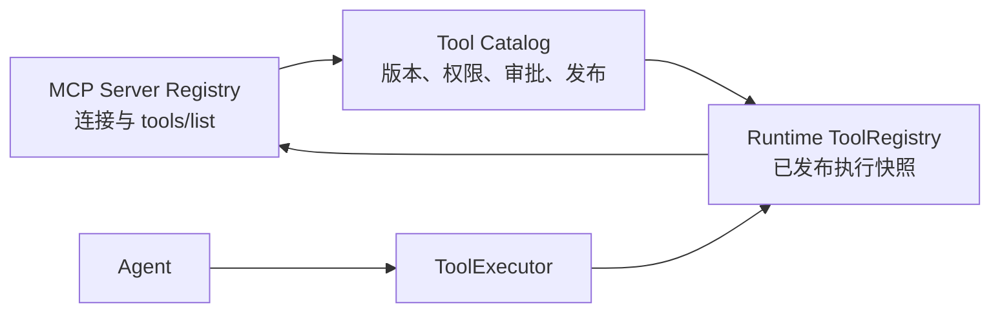

# MCP 工具中心使用与治理指南

## 1. 平台中的职责划分

平台采用三层工具治理结构：



- MCP Server Registry：管理连接并发现远程能力；
- Tool Catalog：PostgreSQL 中的企业治理权威；
- ToolRegistry：当前进程中已经发布的运行时快照；
- ToolExecutor：统一执行鉴权、审批、超时、审计和 Trace。

MCP 工具不会在发现后自动提供给 Agent。

## 2. 数据库迁移

```powershell
python -m alembic upgrade head
```

迁移会创建：

- `ai_mcp_server`
- `ai_mcp_tool_snapshot`

## 3. 接入 MCP Server

进入 **AI 管理 → MCP 工具中心 → 接入 MCP Server**。

Streamable HTTP 示例：

```text
Server 名称：enterprise-oa
Transport：Streamable HTTP
URL：https://oa.example.com/mcp
认证 Header：Authorization
Header Secret 环境变量：OA_MCP_AUTHORIZATION
超时：30
重连次数：2
```

设置环境变量：

```powershell
$env:OA_MCP_AUTHORIZATION = "Bearer your-token"
```

平台数据库只保存 Header 名称到环境变量名称的映射，不保存 Header Secret 明文。

Stdio 示例：

```text
Server 名称：local-files
Transport：Stdio
Command：python
参数：-m,company_file_mcp
```

生产环境应对允许启动的命令增加部署白名单和容器隔离。

## 4. 健康检查

点击“检查连接”，平台会完成 MCP initialize 与 ping，并记录：

- `healthy`
- `unavailable`
- 最近错误
- 审计事件 `mcp.server.health_checked`

健康检查失败不会静默删除已经发布的 Tool 快照。

## 5. 发现工具

点击“发现 / 同步工具”，平台调用：

```text
tools/list
```

发现结果只写入 `ai_mcp_tool_snapshot`：

```text
discovered      新发现，等待治理
published       已发布到 Tool Catalog
schema_changed  远端 Schema 与已知快照不同
unavailable     本次发现中已经不存在
```

逻辑名称默认使用：

```text
server_name.remote_tool_name
```

例如：

```text
enterprise-oa.search_document
```

这可以避免多个 MCP Server 都提供 `search` 时发生冲突。

## 6. Schema 变化保护

平台对名称、描述和 Input Schema 生成 SHA-256 哈希。

```text
旧哈希 == 新哈希 → unchanged
旧哈希 != 新哈希 → schema_changed
```

Schema 变化不会覆盖已经发布的运行时 Tool。旧版本继续保留，管理员检查变化后
需要填写新 Tool 版本并重新发布。

## 7. 治理并发布

在发现工具列表点击“治理并发布”，填写：

```text
Tool 版本：1.0
风险等级：low / medium / high / critical
需要人工审批：是 / 否
```

发布过程：

```text
MCP Tool Snapshot
→ 创建统一 ToolDefinition/ToolVersion
→ Tool Catalog 发布
→ 构造 MCPToolAdapter
→ Runtime ToolRegistry 热加载
```

发布后 Agent 只引用逻辑名称：

```json
{
  "tools": [
    "enterprise-oa.search_document"
  ]
}
```

Agent 不直接保存 MCP URL，也不直接持有 MCP Client。

## 8. Schema 变化后的新版本

如果工具状态为 `schema_changed`：

1. 查看 Schema 哈希和远端说明；
2. 确认输入字段变化；
3. 检查受影响 Agent；
4. 使用新版本号，例如 `2.0`；
5. 重新配置风险和审批策略；
6. 发布到 Tool Catalog；
7. 使用 Agent 评测集回归；
8. 再发布受影响 Agent。

不要复用已经存在的 Tool 版本号。

## 9. 安全规则

- 发现不等于发布；
- MCP Secret 只能通过环境变量或 Secret Provider 引用；
- 高风险写操作必须配置审批；
- 所有 MCP Tool 调用仍经过 ToolExecutor；
- Agent 只能调用自身 Tool 白名单内的逻辑工具；
- MCP 原始工具名称不能绕过平台权限；
- Schema 变化不能静默覆盖线上版本；
- 不可用工具不能创建新的发布版本；
- 审计日志记录 Server 创建、发现、健康检查和 Tool 发布。

## 10. API

```text
GET  /v1/mcp/servers
POST /v1/mcp/servers
POST /v1/mcp/servers/{server_name}/health
POST /v1/mcp/servers/{server_name}/discover
POST /v1/mcp/servers/{server_name}/tools/{tool_id}/publish
```

管理操作需要 `mcp_admin` 角色；页面访问权限为 `ai:mcp:view`。

## 11. 推荐使用边界

优先 MCP：

- 多个 Agent 共享的企业工具；
- OA、ERP、CRM、研发平台；
- 跨语言、跨进程能力；
- 桌面端或内网受控工具；
- 需要独立扩缩容的工具服务。

继续使用 Python Tool：

- Agent 专属算法；
- 极低延迟进程内能力；
- 原型和学习案例；
- 必须和 Agent 同进程工作的能力。

已有 Python/HTTP Tool 不需要为了形式统一而强制迁移到 MCP。
