# 企业级 AI Agent 平台源码架构与面试指南

> 适用目标：理解本项目如何从启动、注册、执行一直运行到模型、工具、记忆、知识库、工作流和治理层，并能够在简历和技术面试中准确说明实现方式。
>
> 本文以当前仓库代码为准。阅读时建议同时打开 IDE，按照每章给出的“源码阅读顺序”设置断点。

---

# 一、先建立正确的项目认识

## 1.1 这不是一个聊天机器人项目

这个项目的定位是企业级 AI Agent 开发与治理平台。它不仅负责调用大模型，还要解决：

- 多个 Agent 如何开发、发现、注册和执行；
- 不同厂商模型如何通过统一名称接入；
- Prompt、Tool、Memory 和知识库如何组合进 Agent；
- 大模型如何安全、自主地调用 Tool；
- MCP Tool 和远程 A2A Agent 如何接入；
- 固定业务流程如何通过 Workflow 编排；
- 长任务如何异步执行、断点恢复和故障接管；
- Agent 如何评测、发布、追踪、审计和运维。

一句话描述：

> 平台通过 Runtime 统一请求入口，通过 Registry 管理运行时资源，通过 Agent 组织模型、记忆、知识和工具，通过 Workflow 编排确定性业务过程，通过 PostgreSQL、Redis、Milvus 和 MinIO 完成企业数据持久化，并通过评测、权限、Trace 和 Worker 建立生产治理能力。

## 1.2 核心设计原则

项目采用“深模块”思路：调用者只学习小而稳定的接口，复杂实现隐藏在模块内部。

例如：

- Runtime 调用 `Dispatcher.dispatch(...)`，不关心 Agent 来自文件、远程 A2A 还是内存注册；
- Agent 调用统一 LLM 接口，不关心底层是阿里百炼还是其他 OpenAI Compatible 模型；
- ToolExecutor 调用统一 Tool 接口，不关心实现来自 Python、HTTP 还是 MCP；
- KnowledgeIngestion 调用统一 DocumentParser 接口，不关心解析来自本地库还是 MinerU；
- WorkflowExecutor 调用节点 Handler，不需要为每种节点修改调度核心。

这些可替换位置称为 seam，具体实现称为 Adapter。

---

# 二、整体架构

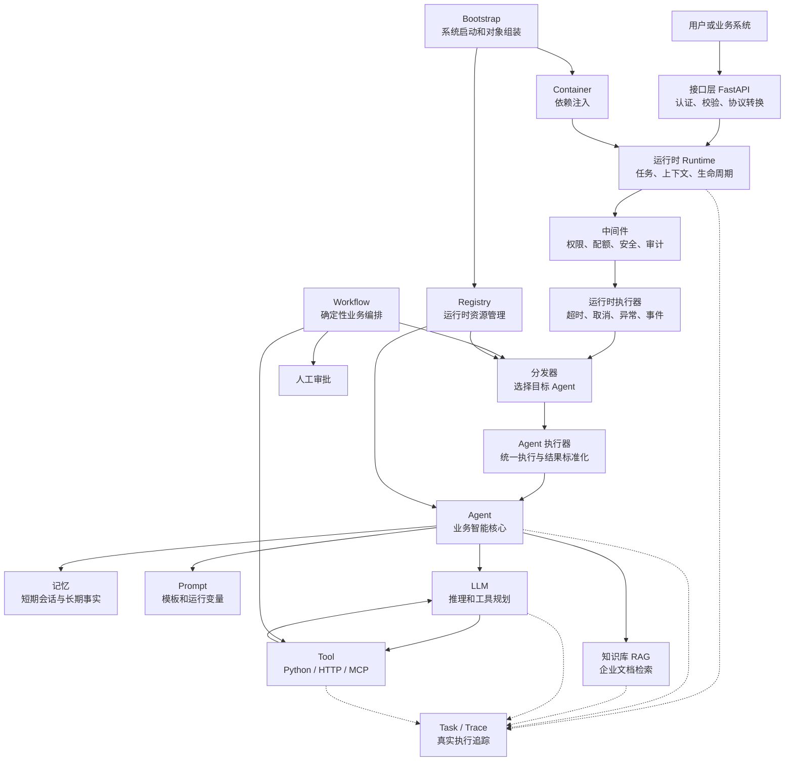

## 2.1 四层理解法

| 层次 | 主要职责 | 代表目录 |
|---|---|---|
| 接入与控制层 | HTTP、认证、管理界面、资源治理 | `app/bootstrap/application.py`、`app/system` |
| 运行与编排层 | Runtime、Dispatcher、Workflow、任务追踪 | `app/runtime`、`app/workflow` |
| Agent 能力层 | Agent、Prompt、LLM、Tool、Memory、Knowledge | `app/agent`、`app/prompt`、`app/llm`、`app/tool`、`app/memory`、`app/knowledge` |
| 基础设施层 | Container、Registry、数据库、向量库、对象存储 | `app/core`、`app/system`、`app/vector` |

---

# 三、系统启动过程是怎么实现的

## 3.1 启动链路

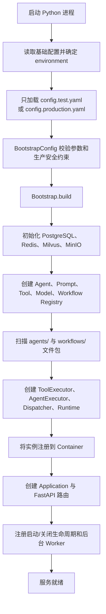

## 3.2 Bootstrap 的实现

入口文件：

- `app/bootstrap/bootstrap.py`
- `app/bootstrap/config.py`
- `app/bootstrap/application.py`

`Bootstrap.build()` 是组合根。组合根是唯一集中创建大型对象图的位置。

它大体完成：

1. 将字典或 YAML 配置解析为 `BootstrapConfig`；
2. 创建数据库、存储和外部连接 Adapter；
3. 创建各类 Registry；
4. 加载模型 Profile；
5. 扫描 Agent、Prompt、Tool 和 Workflow；
6. 建立 Executor 与 Manager；
7. 组装 Runtime；
8. 将对象注册到 Container；
9. 构建 FastAPI Application；
10. 注册后台任务的启动和停止函数。

Bootstrap 不处理用户请求。它只回答：

> 系统启动时，需要创建哪些对象，这些对象按照什么顺序连接。

## 3.3 配置加载为什么按环境进行

配置先读取环境选择，再只加载目标文件：

```text
config.yaml
    environment: production
          ↓
只加载 config.production.yaml
```

这样避免测试配置、生产配置和本地配置相互覆盖，减少把测试密钥或测试数据库带到生产环境的风险。

`BootstrapConfig` 使用 Pydantic 对类型、范围和组合关系进行校验。例如：

- 端口必须在合法范围；
- Workflow 心跳间隔必须小于租约时间；
- chunk overlap 必须小于 chunk size；
- 生产环境必须使用 PostgreSQL；
- 生产密钥应通过环境变量或 Secret 引用读取。

## 3.4 Container(容器) 的实现和作用

源码：`app/core/container/`

Container 保存已经创建的对象，并按照类型或 Provider(提供者) 解析依赖。

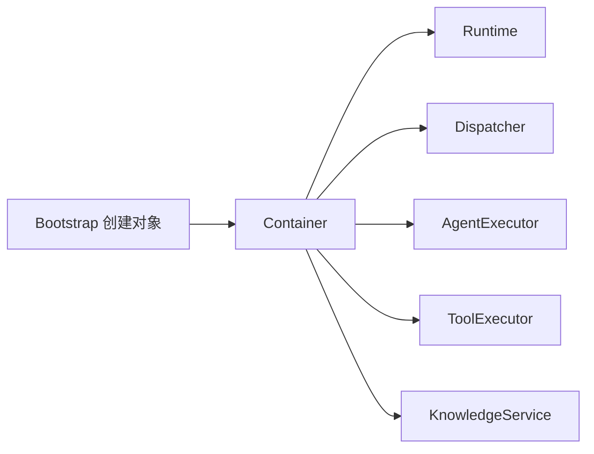

Container 的价值：

- 业务模块不自行创建数据库连接；
- 测试可以注入 InMemory Adapter；
- 生命周期由 Bootstrap 统一控制；
- 对象创建顺序和依赖关系集中可见。

## 3.5 Registry(注册中心) 与数据库的区别

Registry 是运行时索引，数据库是持久化存储。

```text
代码文件 / 配置 / 远程发现
             ↓
         Registry
             ↓
        当前进程直接执行

数据库
  ├─ 用户、权限、配置治理
  ├─ 评测与发布记录
  ├─ Task 和 Trace
  └─ Workflow 检查点
```

不能把 Python Agent 对象直接保存到数据库；也不应在每次请求时重新扫描代码。因此系统启动或主动重新加载时构建 Registry，请求执行时直接查询 Registry。

## 3.6 启动链源码阅读顺序

```text
app/bootstrap/config.py::BootstrapConfig
    ↓
app/bootstrap/bootstrap.py::Bootstrap.build
    ↓
app/core/container/container.py::Container
    ↓
app/core/registry/base.py::BaseRegistry
    ↓
app/bootstrap/application.py::Application
```

## 3.7 面试表达

> Bootstrap 是平台组合根，只在启动阶段运行。它加载并校验当前环境配置，初始化数据库和外部基础设施，创建各类 Registry、Executor 和 Manager，然后通过 Container 完成依赖注入，最后构建 FastAPI Application。业务模块只接收依赖，不自行创建具体基础设施，因此生产 Adapter 和测试 Adapter 可以在同一个 seam 上替换。

---

# 四、一次普通 Agent 请求如何执行

## 4.1 完整链路

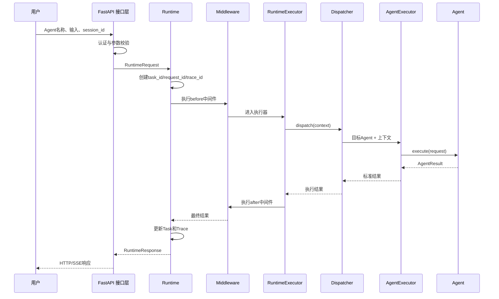

## 4.2 接口层

源码：`app/bootstrap/application.py`

接口层负责：

- JWT 身份认证；
-角色和权限检查；
-请求参数转换；
-将客户端传入的 `session_id`、Agent 名称和业务元数据放入统一请求；
-将平台异常转换为明确的 HTTP 状态码；
-支持普通响应和流式事件。

接口层不直接调用 LLM，因为 HTTP 只是一个接入方式。未来从消息队列、Workflow 或 A2A 进入的请求仍应复用相同执行链。

## 4.3 Runtime

源码：

- `app/runtime/runtime.py`
- `app/runtime/context.py`
- `app/runtime/request.py`
- `app/runtime/task.py`

Runtime 是统一执行入口。它负责：

- 创建请求上下文；
-生成 `request_id`、`task_id` 和 `trace_id`；
-写入任务初始状态；
-执行 Middleware；
-调用 RuntimeExecutor；
-发布任务事件；
-持久化最终状态；
-处理取消、超时和异常收尾。

RuntimeContext 在链路内携带：

- 用户输入；
-Agent 名称；
-租户和用户身份；
-会话编号；
-任务与追踪编号；
-执行状态；
-运行元数据。

## 4.4 Middleware

源码：`app/runtime/middleware.py`

Middleware 用于横切逻辑：

- 身份和租户上下文；
-调用配额和并发限制；
-输入内容安全；
-输出内容安全；
-日志、指标和审计；
-统一异常处理。

这些逻辑不属于任何一个 Agent。如果没有 Middleware，就会在每个 Agent 中复制权限和安全代码。

## 4.5 RuntimeExecutor

源码：`app/runtime/executor.py`

RuntimeExecutor 控制一次执行：

- 调用 Dispatcher；
-控制最大执行时间；
-响应取消信号；
-捕获并转换异常；
-将执行事件写入 EventBus 和 Trace；
-确保 finally 路径释放配额和资源。

Runtime 与 RuntimeExecutor 的区别：

- Runtime 对外提供统一入口和上下文；
- RuntimeExecutor 负责一次具体执行的控制逻辑。

## 4.6 Dispatcher 路由

源码：`app/runtime/dispatcher.py`

Dispatcher 根据 Agent 名称从 AgentRegistry 获取目标 Agent，再交给 AgentExecutor。

```text
agent_name
    ↓
AgentRegistry.get(agent_name)
    ↓
AgentExecutor.execute(agent, context)
```

这个 seam 允许未来加入：

- 明确名称路由；
-规则路由；
-意图路由；
-灰度版本路由；
-远程 A2A Agent 路由。

## 4.7 AgentExecutor

源码：`app/agent/executor.py`

AgentExecutor 负责：

- 以统一方式调用 BaseAgent；
-记录 Agent 开始、完成和失败；
-统计耗时；
-将不同 Agent 返回值标准化为 AgentResult；
-隔离 Agent 异常与 Runtime 异常。

## 4.8 请求链断点顺序

```text
app/bootstrap/application.py  Agent执行接口
    ↓
app/runtime/runtime.py        Runtime.submit/execute
    ↓
app/runtime/middleware.py     before/after
    ↓
app/runtime/executor.py       execute
    ↓
app/runtime/dispatcher.py     dispatch
    ↓
app/agent/executor.py         execute
    ↓
app/agent/base.py             Agent.execute
```

## 4.9 面试表达

> 用户请求不会直接调用 Agent，而是统一进入 Runtime。Runtime 创建 Task、Trace 和租户上下文，中间件统一执行权限、配额和内容安全，RuntimeExecutor 管理超时、取消和异常，Dispatcher 从 AgentRegistry 选择目标 Agent，AgentExecutor 再以统一接口执行具体 Agent。这样 HTTP 接入、平台治理和业务智能相互解耦。

---

# 五、Agent 是如何被开发、发现和注册的

## 5.1 文件包结构

业务 Agent 放在：

```text
agents/
└── travel_agent/
    ├── agent.yaml
    ├── agent.py
    ├── prompts/
    │   ├── travel-system.jinja2
    │   └── travel-system.yaml
    ├── tools/
    │   └── weather.py
    ├── evals/
    └── README.md
```

文件职责：

| 文件 | 作用 |
|---|---|
| `agent.yaml` | Agent 名称、模型、Prompt、Tool、Memory、知识库和实现入口 |
| `agent.py` | 复杂 Agent 的 Python 实现或工厂函数 |
| `prompts/*.jinja2` | Prompt 正文 |
| `prompts/*.yaml` | Prompt 元数据、变量、默认值和说明 |
| `tools/*.py` | 当前 Agent 业务 Tool |
| `evals/` | Agent 回归评测用例 |

## 5.2 加载过程

源码：

- `app/agent/packages.py`
- `app/agent/configuration.py`
- `app/agent/registry.py`

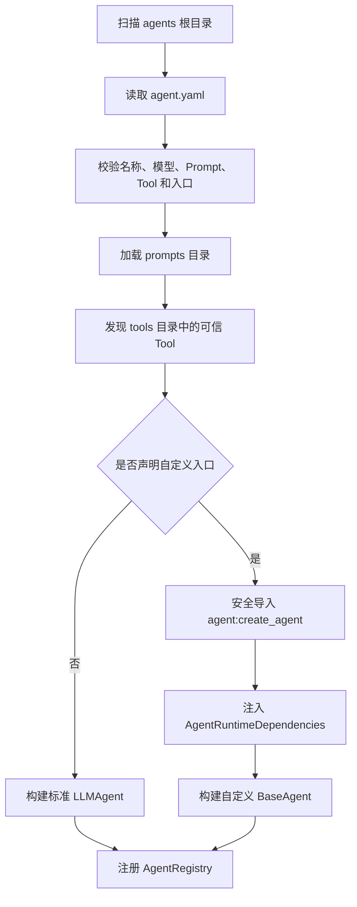

`AgentRuntimeDependencies` 将模型、工具、记忆和知识能力交给自定义 Agent，避免 Agent 自己创建全局对象。

## 5.3 两种 Agent 开发模式

### 标准 LLMAgent

适合：

- 聊天助手；
-RAG 助手；
-自主工具调用；
-大多数单 Agent 业务。

通过 YAML 配置模型、Prompt、Tool 和 Memory，不必改平台底层。

### 自定义 BaseAgent

适合：

- 特殊状态机；
-复杂规划算法；
-自定义流式协议；
-外部系统深度集成；
-标准 LLMAgent 无法表达的业务逻辑。

## 5.4 为什么文件是代码事实源

Agent、Prompt 和 Python Tool 属于代码资产，因此使用：

- 文件保存当前实现；
-Git 管理版本、评审与回滚；
-数据库保存评测、发布、运行和审计数据；
-管理界面展示和编辑受控文件；
-重新加载动作刷新 Registry。

这避免了数据库版本与部署代码不一致。

## 5.5 热加载与最后可用版本

重新加载时平台重新校验文件包。新版本成功时替换 Registry 中对象；加载失败时应保留上一次可用对象并展示失败原因，避免一次错误修改导致所有线上调用立即失效。

## 5.6 面试表达

> Agent 采用文件包组织，每个 Agent 自带声明文件、Python 实现、Prompt、Tool 和评测集。平台启动或重新加载时由 AgentPackageManager 扫描、校验并构建 Agent，最后注册到 AgentRegistry。代码资产由 Git 管理，数据库只保存治理和运行事实，因此能够兼顾开发者习惯、版本追溯和运行效率。

---

# 六、Agent 内部一次推理如何实现

## 6.1 内部主链

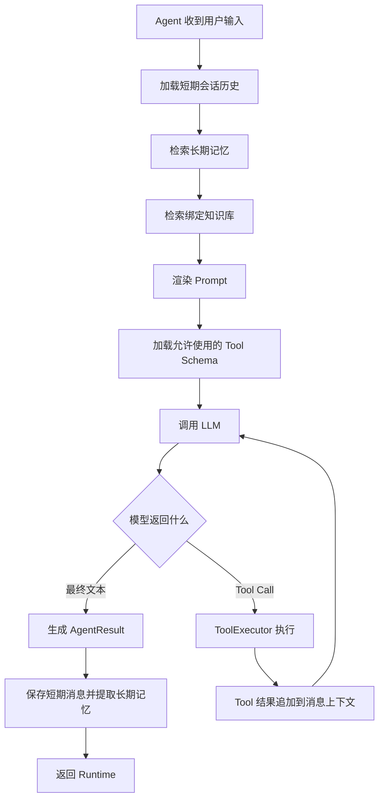

主要源码：`app/agent/base.py::LLMAgent.execute`

## 6.2 上下文组装

LLMAgent 会组合：

1. 系统 Prompt；
2. 当前用户输入；
3. 最近会话历史；
4. 历史摘要；
5. 长期记忆；
6. RAG 文本块；
7. 可用 Tool 的名称、描述和 JSON Schema。

上下文存在硬限制：

- `history_limit` 控制历史条数；
- `knowledge_max_context_chars` 控制知识文本长度；
- `tool_result_max_context_chars` 控制工具结果长度；
- `max_output_tokens` 控制模型输出。

这用于防止 Prompt 无限膨胀。

## 6.3 ReAct / Tool Calling 循环

平台使用模型原生 Tool Calling：

```text
模型分析问题
    ↓
决定直接回答，或输出 Tool Call
    ↓
平台执行 Tool
    ↓
Tool 结果加入上下文
    ↓
模型继续推理
```

模型负责“选择哪个工具”，平台负责“是否允许执行以及如何可靠执行”。

循环必须受到：

- 最大轮次；
-执行超时；
-Tool 权限；
-参数 Schema；
-上下文大小；
-取消信号；

的共同约束，避免 Agent 无限循环。

## 6.4 规划模型与最终模型

Agent metadata 可配置：

- `planning_llm_name`：首轮意图分析和工具选择；
- `final_llm_name`：Tool 返回后的推理和最终回答；
- 主 `llm_name`：未单独配置时的默认模型。

这样可以使用低成本模型做规划，使用高质量模型完成复杂回答。

## 6.5 面试表达

> LLMAgent 在执行前加载会话历史、长期记忆和知识库结果，再渲染 Prompt，并把当前 Agent 被授权使用的 Tool Schema 提供给模型。模型可以直接回答，也可以生成 Tool Call。平台通过 ToolExecutor 完成校验和执行，将结果重新交给模型，循环直到生成最终回答或触发轮次、超时和取消限制。

---

# 七、Prompt 模块怎么实现

## 7.1 Prompt 文件

```text
prompt-name.jinja2   模板正文
prompt-name.yaml     名称、描述、变量Schema、默认值
```

源码：

- `app/prompt/template.py`
- `app/prompt/schema.py`
- `app/prompt/registry.py`
- `app/prompt/evaluation.py`
- `app/prompt/security.py`

## 7.2 渲染过程

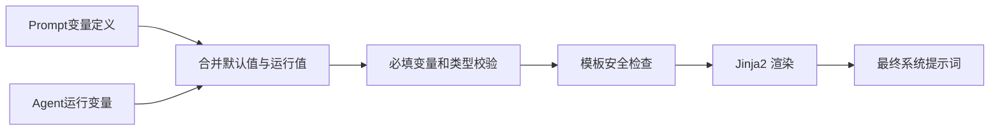

管理界面的变量输入框来自 YAML 中的变量定义，而不是前端猜测模板占位符。

## 7.3 为什么 Prompt 既集中管理又放在 Agent 包内

- PromptRegistry 提供统一加载、查询、评测和渲染能力；
-Prompt 文件放在 Agent 包内，保持业务代码局部性；
-公共 Prompt 可以放在公共包，由多个 Agent 引用；
-Git 负责版本，运行时 Registry 负责热加载。

## 7.4 Prompt 评测

Prompt 评测检查：

- 变量是否完整；
-默认值是否正确；
-模板是否成功渲染；
-渲染结果是否包含期望文本；
-是否触发模板安全规则。

## 7.5 面试表达

> Prompt 不是散落在 Python 中的字符串，而是由 Jinja2 正文和 YAML 变量 Schema 组成的受治理资产。PromptRegistry 统一加载，渲染器先合并默认值和运行变量，再执行必填校验及安全检查，最终生成模型消息。这样 Prompt 可以独立评测、热更新和 Git 回滚。

---

# 八、多模型接入怎么实现

## 8.1 模型 Profile

Agent 只引用逻辑名称：

```yaml
llm_name: dashscope-reasoning
```

模型配置定义：

```yaml
models:
  dashscope-reasoning:
    provider: openai_compatible
    base_url: https://dashscope.aliyuncs.com/compatible-mode/v1
    model: qwen-plus
    api_key_env: DASHSCOPE_API_KEY
```

## 8.2 调用链

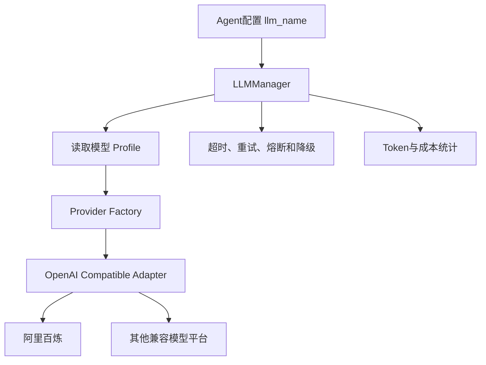

源码：

- `app/llm/base.py`
- `app/llm/configuration.py`
- `app/llm/manager.py`
- `app/llm/openai.py`
- `app/llm/provider.py`
- `app/llm/routing.py`
- `app/llm/resilience.py`
- `app/llm/usage_store.py`

## 8.3 统一接口屏蔽什么差异

- 请求消息格式；
-Tool Calling 格式；
-结构化输出；
-流式响应；
-超时与重试；
-Token 用量字段；
-模型能力差异。

## 8.4 密钥处理

平台同时支持配置值和环境变量引用，但生产环境建议：

```yaml
api_key_env: DASHSCOPE_API_KEY
```

管理界面和日志不返回明文密钥。

## 8.5 面试表达

> 模型层使用逻辑 Profile 解耦 Agent 与模型厂商。Agent 只声明 llm_name，LLMManager 根据 Profile 选择 Provider Adapter。阿里百炼等 OpenAI Compatible 平台复用统一 Adapter，同时由韧性模块处理超时、重试和故障，由 UsageStore 记录 Token 与成本，因此更换模型通常不需要修改 Agent 代码。

---

# 九、Tool 系统怎么实现

## 9.1 Tool 来源

平台统一管理：

- 本地 Python Tool；
-远程 HTTP Tool；
-MCP Tool。

它们最终都转换为统一 Tool 接口和描述：

- 工具名称；
-功能描述；
-输入 JSON Schema；
-风险等级；
-审批策略；
-并行安全性；
-副作用和幂等性；
-执行实现。

## 9.2 ToolExecutor 链路

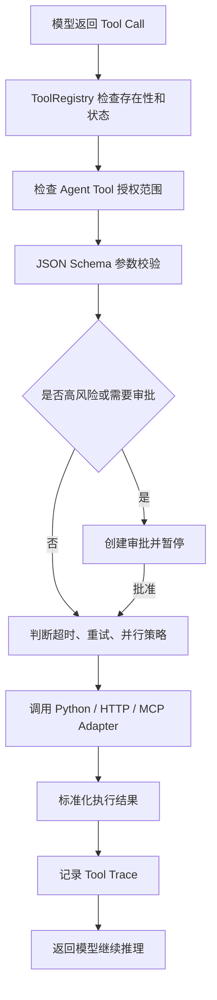

源码：

- `app/tool/base.py`
- `app/tool/registry.py`
- `app/tool/executor.py`
- `app/tool/discovery.py`
- `app/tool/approval.py`
- `app/tool/remote.py`
- `app/tool/sandbox.py`

## 9.3 可信包机制

平台只从明确允许的包目录发现 Python Tool，不允许前端传入任意模块路径。

三层安全控制：

1. 可信目录：只有部署和代码评审允许的目录可扫描；
2. Registry：只有真实发现和成功加载的 Tool 可调用；
3. Agent 授权：Agent 只能调用自身绑定的 Tool。

## 9.4 Tool 失效怎么处理

重新扫描时会验证实现。如果文件删除、方法消失或 Schema 不兼容：

- 新版本不进入可用 Registry；
-引用它的 Agent 显示依赖异常；
-Trace 记录具体失败；
-不能因为数据库中还存在名称就继续假执行。

## 9.5 Tool 并行

只有一批 Tool 全部满足：

```yaml
parallel_safe: true
side_effects: false
```

才允许有界并行。有写操作、支付、发送消息、审批等副作用 Tool 保持串行。

## 9.6 面试表达

> 模型负责生成 Tool Call，但平台不信任模型输出。ToolExecutor 先从 Registry 校验真实存在性，再执行 Agent 授权、JSON Schema、风险审批和执行策略检查，最后调用 Python、HTTP 或 MCP Adapter。只有无副作用且声明并行安全的工具才允许有界并发。

---

# 十、MCP 怎么接入 Tool 中心

## 10.1 MCP 的职责

MCP 解决外部工具的标准发现和调用；ToolRegistry 解决平台内部的统一治理。两者不是替代关系。

## 10.2 协议链路

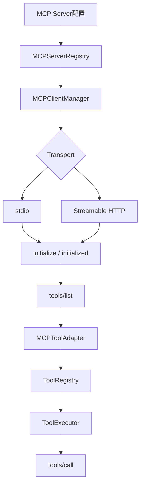

源码：`app/mcp/`

实现能力：

- 协议初始化；
-Tool 列表发现；
-stdio 和 Streamable HTTP；
-Session ID；
-JSON/SSE 响应；
-超时、重连和会话恢复；
-Schema 变化检测；
-调用审计。

## 10.3 Schema 变化治理

MCP Tool 的 Schema 可能在远端变化。平台发现变化后不应静默覆盖已发布 Tool，而应：

1. 记录新 Schema；
2.标记变更；
3.创建新的候选版本；
4.重新评测；
5.通过后发布。

## 10.4 面试表达

> MCP Server 通过标准协议暴露工具。平台由 MCPClient 完成初始化和 tools/list，再通过 MCPToolAdapter 转成统一 Tool 注册进 ToolRegistry。因此 Agent 不需要区分本地 Tool 和 MCP Tool，权限、审批、参数校验和 Trace 仍统一由 ToolExecutor 处理。

---

# 十一、Memory 怎么实现

## 11.1 Memory 命名空间

记忆按以下维度隔离：

```text
tenant_id + user_id + agent_id + session_id
```

这保证不同租户、用户、Agent 和会话之间不会串数据。

## 11.2 短期记忆

短期记忆保存当前会话消息：

- 用户输入；
-Agent 回答；
-时间；
-消息角色；
-会话编号。

执行时只加载最近 `history_limit` 条，以及更早消息的摘要。

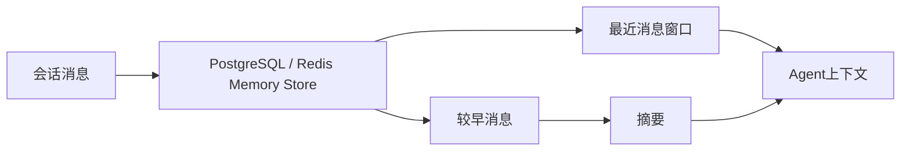

关闭页面不会自动删除短期记忆。重新打开时只要恢复相同 `session_id`，平台就可以读取原会话。

## 11.3 长期记忆

长期记忆不保存每句话，而是保存以后仍有价值的信息：

- 用户偏好；
-稳定身份事实；
-长期目标；
-确认过的约束；
-有复用价值的业务事实。

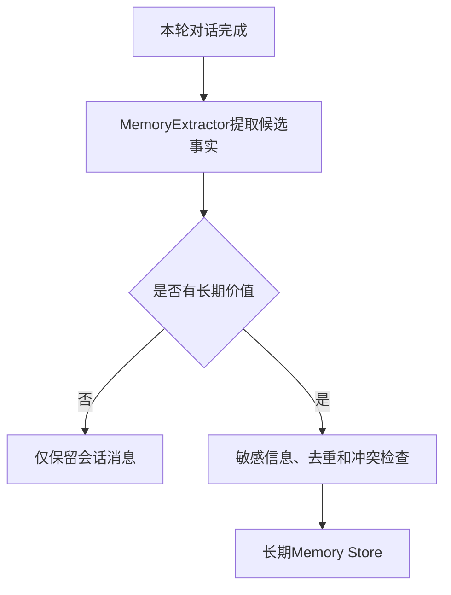

## 11.4 摘要

历史超过上下文窗口后，由 Summarizer 将较早消息压缩成摘要。摘要用于模型上下文，原始消息是否保留由持久化和治理策略决定。

源码：

- `app/memory/manager.py`
- `app/memory/store.py`
- `app/memory/distributed_store.py`
- `app/memory/extractor.py`
- `app/memory/summarizer.py`
- `app/memory/governance.py`

## 11.5 面试表达

> Memory 使用租户、用户、Agent 和 session 四维命名空间隔离。短期记忆保存会话消息，并通过最近窗口加历史摘要控制 Token；长期记忆由 Extractor 从每轮对话中提取稳定、有复用价值的信息，再经过敏感信息、去重和冲突治理后持久化，因此不是把每句话都写入长期记忆。

---

# 十二、知识库和 RAG 怎么实现

## 12.1 数据分工

| 数据 | 存储位置 |
|---|---|
| 原始文件 | MinIO |
| 知识库、文档、文本块、状态 | PostgreSQL |
| 稠密/稀疏向量 | Milvus |
| 向量化可靠事件 | PostgreSQL Outbox |
| Embedding | BGE-M3 |
| 重排 | bge-reranker-large |

## 12.2 文档入库链路

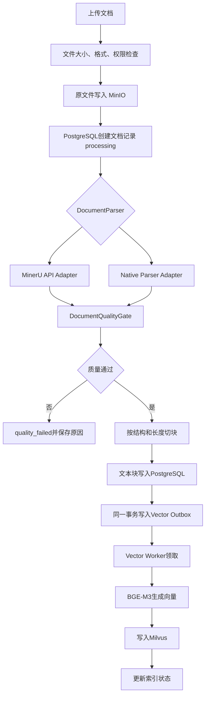

## 12.3 解析器 seam

源码：`app/knowledge/parsing.py`

统一 `DocumentParser.parse(...)` 返回 `ParsedDocument`。Adapter 包括：

- Native Parser：普通文本、Markdown、CSV、HTML、PDF、DOCX；
- MinerUPrecisionParser：复杂 PDF、扫描件、表格、公式及旧格式；
- FallbackDocumentParser：主解析失败时按配置降级。

上层切块和质量检查只依赖 ParsedDocument，不依赖具体解析厂商。

## 12.4 质量门禁

DocumentQualityGate 检查：

- 最少有效字符；
-乱码替换字符比例；
-重复内容比例；
-空块；
-整体质量分。

失败文档保留原文件、状态和错误，但不进入向量索引。

## 12.5 为什么使用 Outbox

PostgreSQL 和 Milvus 不能共享本地事务。如果直接先写数据库再写向量库，中途崩溃会产生不一致。

Outbox 方案：

```text
PostgreSQL事务：保存文本块 + 保存待向量化事件
                       ↓ 提交成功
Vector Worker领取事件
                       ↓
Embedding + Milvus写入
                       ↓
更新事件和文档索引状态
```

失败事件可以重试，不会丢失。

## 12.6 检索链路

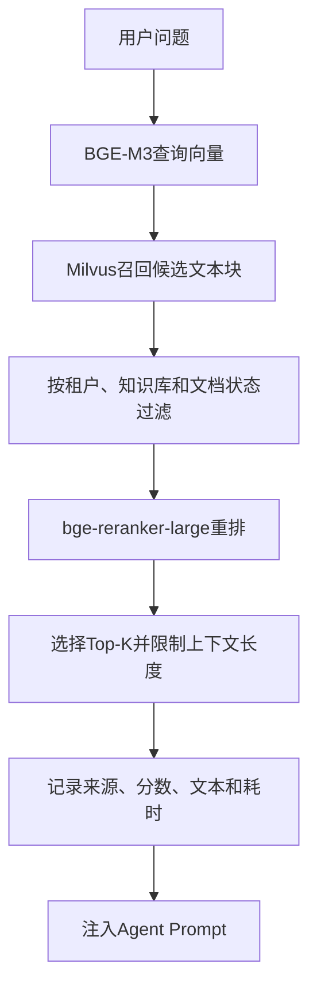

## 12.7 当前大文件边界

当前默认单文件限制 20MB，API 在限制范围内将文件读取为 bytes；批量默认最多 20 个并逐个解析。因此适合中等规模企业文档，但不属于 GB 级流式处理。

真正超大文件的目标方案应是：浏览器分片直传 MinIO、异步 Document Worker、按页解析、检查点恢复和增量切块。

## 12.8 源码阅读顺序

```text
app/bootstrap/application.py  上传接口
    ↓
app/knowledge/ingestion.py    入库编排
    ↓
app/knowledge/parsing.py      解析与质量
    ↓
app/knowledge/service.py      PostgreSQL事实
    ↓
app/vector/outbox.py          异步向量事件
    ↓
app/vector/milvus.py          向量Adapter
```

## 12.9 面试表达

> 文档原件存 MinIO，元数据和文本块存 PostgreSQL，向量存 Milvus。解析层通过统一 DocumentParser seam 接入本地解析和 MinerU，解析后先做质量门禁，再进行结构化切块。数据库事务同时写文本块和 Outbox 事件，Vector Worker 异步生成 BGE-M3 向量并写 Milvus，从而解决 PostgreSQL 与向量库之间没有分布式事务的问题。查询时先向量召回，再用 bge-reranker-large 重排，最后把 Top-K 文本块注入 Agent。

---

# 十三、A2A 多 Agent 通信怎么实现

## 13.1 A2A 与 MCP 的区别

- MCP 面向 Tool：远程函数、数据和能力；
-A2A 面向 Agent：有任务、状态、上下文、流式事件和产物。

## 13.2 调用链

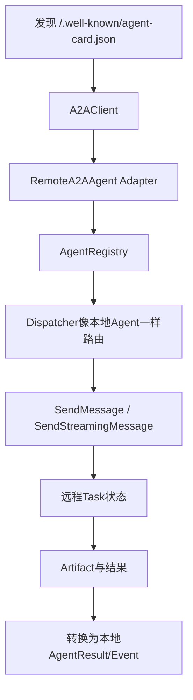

源码：`app/a2a/`

本地取消会尽力调用远程 CancelTask。通过 Adapter 后，Dispatcher 不需要区分本地 Agent 与远程 Agent。

## 13.3 面试表达

> A2A 客户端先通过 Agent Card 发现远程能力，再由 RemoteA2AAgent Adapter 将远程任务、事件和产物转换为本地 BaseAgent 接口并注册到 AgentRegistry。Dispatcher 因此可以用同一方式路由本地和远程 Agent。

---

# 十四、Workflow 怎么实现固定业务流程

## 14.1 Agent 与 Workflow 的边界

| 场景 | 推荐 |
|---|---|
| 开放式问答和自主工具选择 | Agent |
| 固定审批、状态流转和合规流程 | Workflow |
| 既需要确定性又需要推理 | Workflow 节点调用 Agent |

## 14.2 声明式工作流

工作流放在：

```text
workflows/<name>/workflow.yaml
```

支持：

- DAG 依赖；
-条件；
-并行；
-循环；
-Map；
-子工作流；
-Agent 节点；
-Tool 节点；
-人工审批；
-重试；
-补偿；
-断点续跑。

## 14.3 编译过程

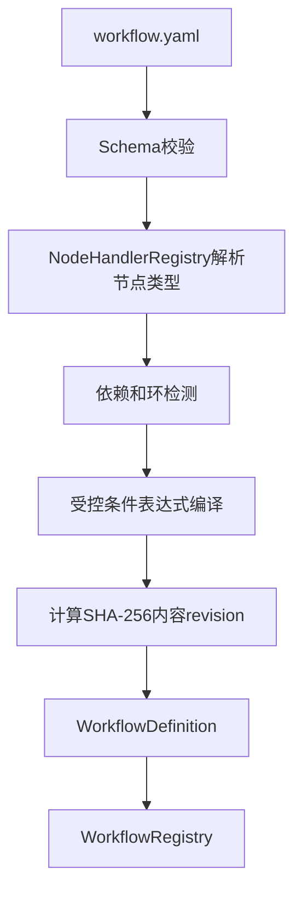

源码：

- `app/workflow/compiler.py`
- `app/workflow/expressions.py`
- `app/workflow/nodes.py`
- `app/workflow/packages.py`
- `app/workflow/registry.py`

表达式引擎只允许 equals、contains、exists、all、any、not 等受控操作，不使用任意 Python `eval`。

## 14.4 执行过程

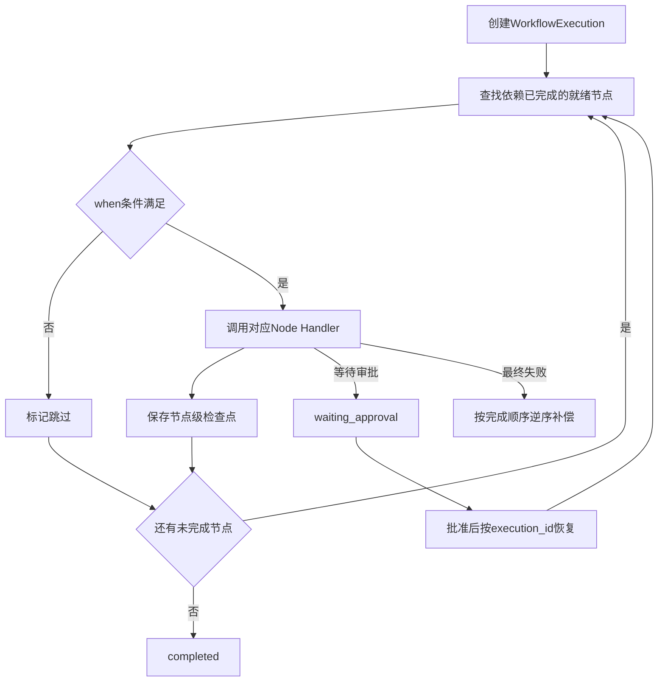

源码：`app/workflow/executor.py`

## 14.5 节点检查点和幂等

每个节点记录：

- 输入；
-输出；
-开始和完成时间；
-状态；
-重试次数；
-错误；
-幂等键。

节点开始、完成、失败和等待审批时都会持久化，因此进程重启后可以恢复。

## 14.6 revision 与定义快照

执行记录保存：

- 逻辑版本；
-内容 revision；
-可重建的工作流定义快照。

热更新后：

- 新任务使用新 revision；
-运行中任务使用启动时 revision；
-进程重启后可从数据库快照重新编译旧定义并恢复。

## 14.7 面试表达

> Workflow 使用 YAML 声明节点、依赖和条件，由 WorkflowCompiler 校验 DAG、编译受控表达式并生成内容 revision。Executor 按依赖调度就绪节点，支持同层并行，每个节点状态写入 PostgreSQL 检查点。运行记录保存定义快照，因此热更新或进程重启不会改变运行中任务的逻辑。失败时可重试并逆序补偿，审批节点进入 waiting_approval 后使用原 execution ID 恢复。

---

# 十五、分布式 Workflow Worker 怎么实现

## 15.1 为什么需要独立 Worker

长工作流不适合占用 HTTP 请求生命周期。生产模式下：

```text
API submit → PostgreSQL pending → Workflow Worker → WorkflowExecutor
```

## 15.2 租约、心跳和防并发令牌

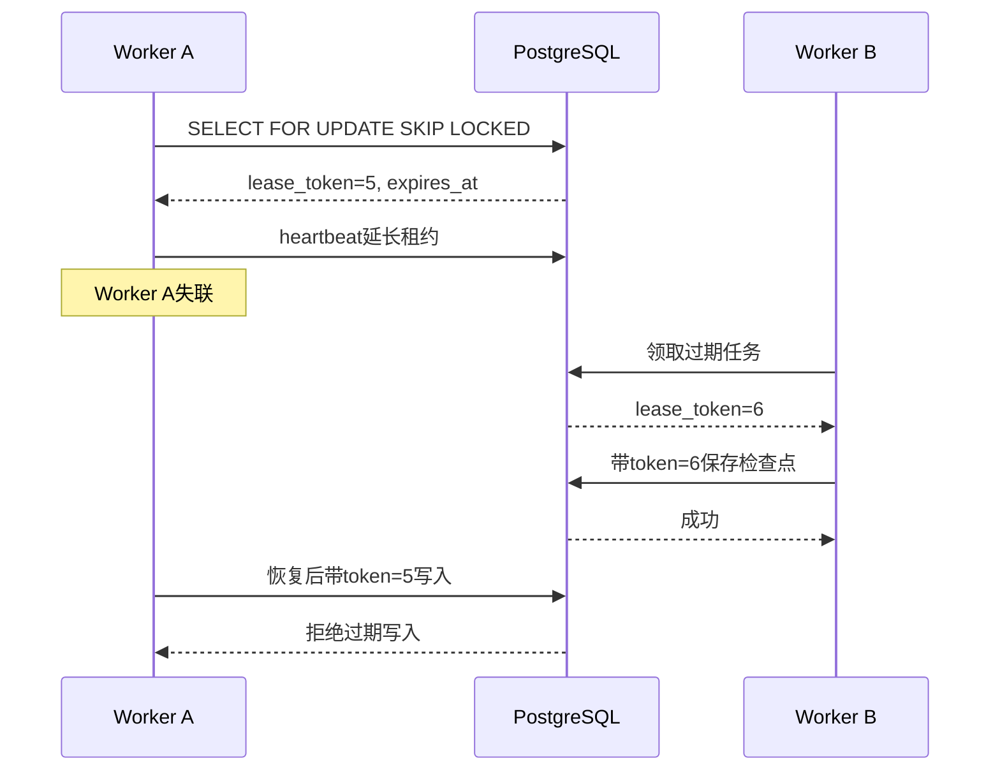

数据库字段包括：

- `leased_by`；
-`lease_token`；
-`lease_expires_at`；
-`heartbeat_at`；
-`worker_attempts`；
-`last_worker_error`。

源码：

- `app/workflow/worker.py`
- `app/workflow/store.py`
- `workflow_worker.py`

## 15.3 为什么只有租约还不够

旧 Worker 可能在网络暂停后恢复，并不知道任务已被接管。如果只判断本地租约，它可能覆盖新 Worker 状态。

Fencing token 每次领取递增，数据库写入必须匹配当前 token，从存储层拒绝旧 Worker。

## 15.4 重试和失败归档

Worker 基础设施异常时：

1. 保存最后错误；
2.按照 Worker 尝试次数退避；
3.租约到期后允许接管；
4.达到最大尝试次数后标记 failed；
5.保留 `last_worker_error` 供运维排查。

业务节点自身失败由 WorkflowExecutor 的节点重试和补偿负责，不应与 Worker 崩溃重试混淆。

## 15.5 面试表达

> Workflow API 默认只持久化提交，独立 Worker 使用 `SELECT FOR UPDATE SKIP LOCKED` 领取任务。领取时写入有期限的租约并递增 fencing token，执行期间定期心跳续租。Worker 崩溃后其他实例接管过期任务，所有检查点写入必须匹配当前 owner 和 token，因此旧 Worker 恢复后也无法覆盖新状态。

---

# 十六、任务追踪和可观测性怎么实现

## 16.1 Task 与 Trace 的区别

- Task：业务执行状态，例如 queued、running、completed、failed、cancelled；
-Trace：一次任务内部发生的具体步骤和耗时。

## 16.2 事件链

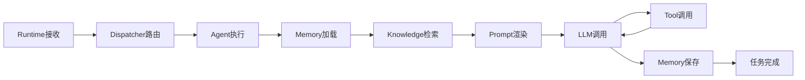

Trace 记录：

- 时间；
-阶段名称；
-输入输出摘要；
-状态；
-耗时；
-模型和 Token；
-Tool 名称和参数；
-RAG 文本块、分数和来源；
-异常信息。

源码：

- `app/runtime/task.py`
- `app/runtime/trace.py`
- `app/runtime/persistence.py`
- `app/runtime/event_bus.py`
- `app/core/telemetry.py`
- `app/llm/usage_store.py`

## 16.3 前端为什么显示真实链路

前端不是按固定步骤播放动画，而是读取 Task Event 和 Trace。某一步未实际发生，例如没有调用 Tool，就不应该伪造 Tool 成功节点。

## 16.4 面试表达

> 平台将 Task 状态与 Trace 步骤分开：Task 描述整体生命周期，Trace 记录 Runtime、Agent、Memory、RAG、LLM 和 Tool 的真实跨度。各模块在统一追踪上下文下写入事件，前端按 Trace 数据还原流程，因此既可用于用户可视化，也可用于性能分析、评测断言和审计。

---

# 十七、Agent 评测和发布怎么实现

## 17.1 评测数据集

用例包含：

- 用户输入；
-Prompt 运行变量；
-期望文本；
-Tool 调用断言；
-正则断言；
-最大延迟；
-最大 Token；
-其他业务断言。

## 17.2 评测执行

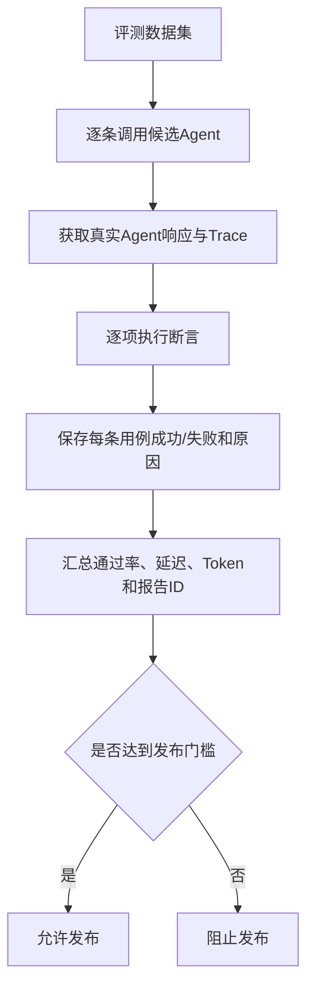

## 17.3 草稿为什么应该可以评测

正确生命周期是：

```text
开发草稿 → 评测 → 修正 → 再评测 → 发布
```

如果只能发布后评测，就失去了发布门禁的意义。

## 17.4 评测可追溯

报告保存：

- Agent 标识和版本；
-Prompt/Tool/模型信息；
-输入和运行变量；
-实际响应；
-Trace ID；
-断言结果；
-失败原因；
-耗时和 Token；
-报告 ID。

## 17.5 版本策略

代码版本由 Git 管理；评测报告和发布记录由数据库管理。发布时引用通过的报告，保证发布对象与被评测对象一致。

## 17.6 面试表达

> Agent 草稿可直接运行真实评测。平台逐条执行数据集并利用真实响应和 Trace 检查文本、正则、Tool 调用、延迟与 Token 等断言，保存可追溯报告。发布必须引用同一候选对象的通过报告，从而形成开发、评测、发布和回归的质量闭环。

---

# 十八、权限、安全和治理怎么实现

## 18.1 认证与授权

系统管理模块负责：

- 用户；
-角色；
-菜单；
-权限点；
-JWT 身份；
-管理接口角色校验；
-审计日志。

## 18.2 多层安全

```text
接口层认证
    ↓
租户与用户上下文
    ↓
Runtime配额和内容安全
    ↓
Agent允许的Tool集合
    ↓
Tool参数、权限和审批
    ↓
外部系统凭证与网络策略
```

## 18.3 Secret

生产密钥通过环境变量或 Secret Provider 引用，避免：

- 写进 Git；
-前端回显；
-日志输出；
-数据库明文暴露。

## 18.4 当前单租户策略

即使公司内部暂不做多租户产品，底层仍携带 tenant_id，以保证未来扩展和当前数据隔离。产品界面可以只暴露默认租户，而不是删除底层租户上下文。

---

# 十九、数据存储为什么这样选择

| 基础设施 | 负责的数据 | 选择原因 |
|---|---|---|
| PostgreSQL | 用户、权限、配置治理、Memory、知识元数据、Task、Trace、Workflow | 事务、关系查询、可靠持久化 |
| Redis | 缓存、高频短期状态 | 低延迟、过期策略 |
| Milvus | 知识和记忆向量 | 大规模向量近邻检索 |
| MinIO | 原始文档、结果文件 | 对象存储和大文件能力 |
| Git | Agent、Prompt、Python Tool、Workflow | 代码审查、差异、回滚和部署复现 |
| Alembic | PostgreSQL Schema | 可追踪数据库迁移 |

原则不是“数据库越多越企业级”，而是让不同访问模式使用合适存储，同时通过稳定 seam 隔离实现。

---

# 二十、生产部署怎么拆分

## 20.1 推荐进程

```mermaid
flowchart TD
    CLIENT["前端/业务系统"] --> API["主API进程"]
    API --> PG["PostgreSQL"]
    API --> REDIS["Redis"]
    API --> MINIO["MinIO"]
    API --> INF["Embedding/Rerank推理服务"]
    API --> MILVUS["Milvus"]
    VW["Vector Worker"] --> PG
    VW --> INF
    VW --> MILVUS
    WW["Workflow Worker"] --> PG
    WW --> API
```

四类进程：

1. 主 API：HTTP、Runtime、Agent 和系统管理；
2. 推理服务：加载 BGE-M3 与 Reranker；
3. Vector Worker：消费 Outbox 并写 Milvus；
4. Workflow Worker：执行长工作流。

这样可以独立扩容 HTTP 流量、GPU 推理、知识索引和长任务。

## 20.2 数据库迁移

部署前执行：

```powershell
python -m alembic upgrade head
```

滚动发布顺序：

```text
兼容性数据库迁移 → Worker → API → 前端
```

## 20.3 健康检查和观测

- `/health/live`：进程是否存活；
-`/health/ready`：数据库等关键依赖是否可用；
-Prometheus：请求、延迟、错误、模型和 Worker 指标；
-OpenTelemetry：分布式 Trace。

---

# 二十一、测试体系怎么实现

## 21.1 测试分层

- 模块测试：Prompt、表达式、Tool 校验等纯逻辑；
-Agent 测试：注入模拟 LLM 和 Tool；
-Runtime 集成测试：完整 Dispatcher 与 AgentExecutor；
-Store 测试：SQLite/InMemory Adapter；
-接口测试：FastAPI 测试客户端；
-Workflow 测试：检查点、审批、恢复、租约和 fencing token。

## 21.2 为什么依赖注入使测试更容易

生产：

```text
MemoryStore → PostgreSQL/Redis
VectorStore → Milvus
LLM → DashScope
```

测试：

```text
MemoryStore → InMemory
VectorStore → Fake
LLM → Stub
```

调用者仍使用相同接口，因此无需启动所有外部系统才能验证业务逻辑。

当前回归基线：195 项自动化测试通过，另有 1 项环境隔离测试按条件取消选择。该数字应随项目演进更新，简历使用前需要重新执行测试确认。

---

# 二十二、建议的源码学习顺序

## 第一轮：只理解主链

```text
1. app/bootstrap/config.py
2. app/bootstrap/bootstrap.py::build
3. app/bootstrap/application.py 中的Agent接口
4. app/runtime/runtime.py
5. app/runtime/executor.py
6. app/runtime/dispatcher.py
7. app/agent/executor.py
8. app/agent/base.py::LLMAgent.execute
```

目标：能画出从 HTTP 到 AgentResult 的链路。

## 第二轮：理解 Agent 能力

```text
1. app/agent/packages.py
2. app/prompt/template.py
3. app/llm/manager.py
4. app/tool/executor.py
5. app/memory/manager.py
6. app/knowledge/service.py
```

目标：能说明上下文、模型、工具、记忆和知识如何组合。

## 第三轮：理解企业能力

```text
1. app/runtime/trace.py
2. app/agent/governance.py
3. app/mcp/client.py
4. app/a2a/remote_agent.py
5. app/workflow/compiler.py
6. app/workflow/executor.py
7. app/workflow/worker.py
```

目标：能说明治理、协议、工作流和可靠执行。

---

# 二十三、推荐的调试断点路线

使用一个绑定 Prompt、Memory、知识库和 Tool 的 Agent，发送一条需要调用工具的问题。

断点顺序：

```text
Application Agent接口
→ Runtime.submit/execute
→ Middleware.before
→ RuntimeExecutor.execute
→ Dispatcher.dispatch
→ AgentExecutor.execute
→ LLMAgent.execute
→ MemoryManager加载
→ KnowledgeService检索
→ Prompt渲染
→ LLMManager调用
→ ToolExecutor.execute
→ 第二次LLM调用
→ MemoryManager.remember
→ Runtime任务完成
```

调试时记录：

- RuntimeContext 有哪些字段；
-Registry 返回的真实对象是什么；
-Prompt 最终渲染文本；
-模型收到的 Tool Schema；
-Tool Call 参数；
-RAG 返回的文本块；
-Trace 中每个 span 的时间。

完成这一次调试，基本可以理解主框架 70% 以上。

---

# 二十四、简历应该怎样描述这个项目

## 24.1 推荐项目名称

**企业级 AI Agent 开发与治理平台**

如果是个人完成，应明确标注“个人技术项目”，不要伪装成公司正式生产项目。

## 24.2 推荐项目描述

> 基于 Python、FastAPI 构建企业级 AI Agent 开发与治理平台，提供 Agent、Prompt、LLM、Tool、Memory、RAG 和 Workflow 的统一开发、注册、评测、发布与运行能力；支持代码包动态加载、MCP/A2A、多模型接入、知识库检索、任务追踪和分布式工作流执行。

## 24.3 推荐项目亮点

- 设计 Runtime、Middleware、Dispatcher、AgentExecutor、Agent 分层执行链，通过 Container 与 Registry 实现依赖注入及运行时资源管理。
- 实现文件化 Agent Package，支持 Agent、Prompt、Python Tool 与评测集的扫描发现、动态注册和重新加载，并使用 Git 管理代码版本。
- 建设 Memory 与 RAG 能力，支持会话历史、长期记忆提取、MinerU 文档解析、质量门禁、BGE-M3 向量化、Milvus 召回和 Reranker 重排。
- 实现声明式 Workflow 引擎，支持 DAG、条件、并行、循环、Map、子工作流、人工审批、补偿和断点续跑。
- 基于 PostgreSQL 租约、心跳和 fencing token 实现多 Workflow Worker 故障接管和并发写保护。
- 接入 MCP 与 A2A，统一治理本地工具、远程工具和远程 Agent；建设自动化评测、任务追踪、权限审计和模型用量统计。

## 24.4 简历必须保持真实

可以写：

- 已实现的模块和调用链；
-通过的自动化测试；
-实际使用的数据库和模型；
-本机或测试环境完成的联调。

没有真实证据时不要写：

- 支撑百万并发；
-生产 QPS；
-服务大型客户；
-显著降低某项成本；
-生产可用率 99.99%。

---

# 二十五、三分钟面试讲解模板

> 这个项目是一个企业级 AI Agent 开发与治理平台，不是单一聊天机器人。整体采用分层执行架构，请求进入 FastAPI 后统一交给 Runtime。Runtime 创建任务和 Trace，并通过 Middleware 执行权限、配额和内容安全，RuntimeExecutor 负责超时、取消和异常处理，Dispatcher 再从 AgentRegistry 路由目标 Agent，由 AgentExecutor 统一执行。
>
> Agent 内部会加载短期会话、长期记忆和绑定知识库，渲染 Jinja2 Prompt 后调用逻辑模型 Profile。模型可以直接回答，也可以生成 Tool Call；ToolExecutor 会校验工具存在性、Agent 授权、JSON Schema 和风险审批，再执行 Python、HTTP 或 MCP Tool，结果回传模型继续推理。
>
> 知识库原文件保存在 MinIO，元数据和文本块保存在 PostgreSQL。文档通过 MinerU 或本地 Parser 解析，质量检测通过后切块，并通过 Outbox 交给 Vector Worker，使用 BGE-M3 生成向量写入 Milvus，检索后使用 bge-reranker-large 重排。
>
> 对固定业务流程，平台实现声明式 Workflow，支持 DAG、条件、并行、循环、子工作流、人工审批、补偿和断点续跑。长任务由独立 Worker 执行，通过 PostgreSQL 租约、心跳和 fencing token 防止重复执行以及旧 Worker 覆盖新状态。
>
> Agent、Prompt、Python Tool 和 Workflow 采用文件包与 Git 管理，数据库保存评测、发布和运行事实。平台同时具备自动化评测、任务追踪、权限审计、MCP/A2A 和独立 Worker 部署能力。

---

# 二十六、面试高频追问清单

## 架构

1. Runtime 与 AgentExecutor 为什么分开？
2. Bootstrap、Container、Registry 分别解决什么问题？
3. 为什么 Registry 不能直接由数据库替代？
4. 为什么 Agent 代码使用文件和 Git 管理？

## Agent 和 Tool

1. 模型如何自主选择 Tool？
2. 如何防止模型调用未授权工具？
3. Tool Schema 如何校验？
4. 哪些 Tool 可以并行？
5. Tool 实现删除后平台如何处理？

## Memory

1. 短期与长期记忆的区别？
2. 为什么不保存每条消息为长期记忆？
3. session_id 如何恢复会话？
4. 摘要如何控制 Token？

## RAG

1. 为什么 PostgreSQL、MinIO 和 Milvus 要分开？
2. Outbox 解决什么一致性问题？
3. MinerU 失败如何降级？
4. 文档质量不通过如何处理？
5. 召回与重排的区别？

## Workflow

1. Agent 与 Workflow 的边界是什么？
2. 循环和条件如何避免执行任意代码？
3. 节点失败如何重试和补偿？
4. 服务重启后如何恢复旧定义？
5. 为什么租约之外还需要 fencing token？

## 企业治理

1. 草稿为什么应该先评测再发布？
2. 如何保证评测对象和发布对象一致？
3. Trace 与业务日志有什么区别？
4. 密钥如何避免泄露？

---

# 二十七、真正“吃透项目”的验收标准

当你可以不看文档完成下面任务时，说明已经真正理解：

1. 画出完整请求链并说出每个类所在文件；
2. 新建一个 Agent 文件包并被平台重新加载；
3. 添加一个 Python Tool，并说明三层安全控制；
4. 配置两个模型并让不同 Agent 按名称选择；
5. 调试一条包含 Memory、RAG、LLM 和 Tool 的真实 Trace；
6. 上传文档并解释从 MinIO 到 Milvus 的每一步；
7. 写一个包含条件、并行和审批的 Workflow；
8. 手动停止一个 Workflow Worker，并解释其他 Worker 如何接管；
9. 创建评测集，定位一条失败断言的真实原因；
10. 用三分钟和十五分钟两个版本讲清楚项目。

建议学习方式：

```text
先画图
  ↓
再跟一次真实断点
  ↓
手写一个Agent和Tool
  ↓
写一个Workflow
  ↓
故意制造一次模型、Tool、RAG和Worker失败
  ↓
从Trace和数据库解释系统如何恢复
```

做到这一步，简历中的每一个技术点都会有真实代码、执行过程和设计理由支撑。
