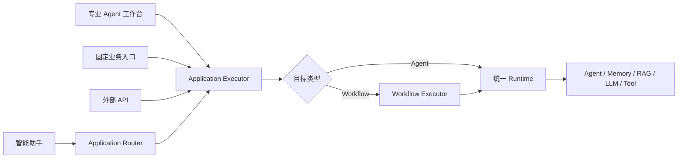
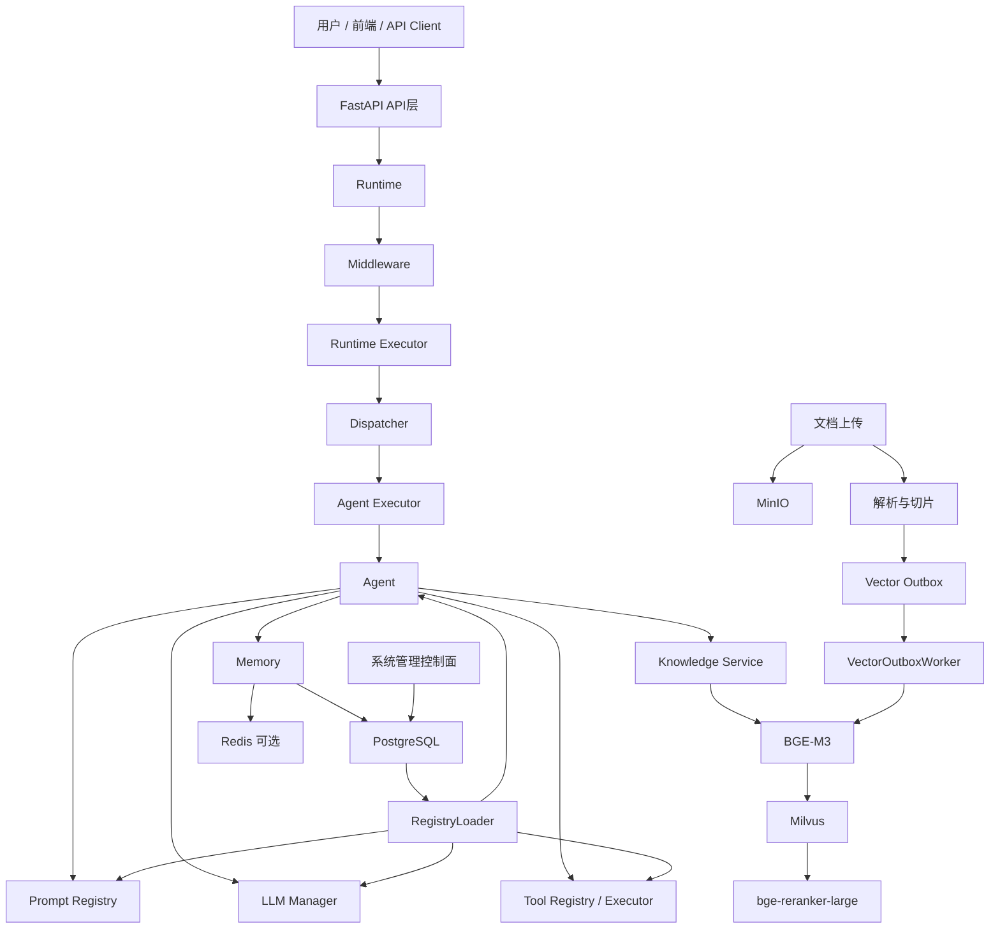

# 企业级 AI Agent 平台：架构与开发指南

> 本文以当前代码为准，是理解平台、排查链路和开发 Agent 的统一入口。

## 一、平台定位

本项目不是单个聊天机器人，而是统一管理和运行 Agent、Prompt、模型、Tool、Memory、Knowledge、Workflow、MCP、A2A、权限和任务追踪的企业 AI 平台。

平台分为：

- **控制面**：系统管理、组件配置、版本、发布、权限、审计和用量。
- **数据面**：处理用户请求，执行 Agent、模型、工具、记忆和 RAG。

## 二、统一入口架构

平台对外提供五类入口，但底层不复制执行链：

| 入口 | 面向对象 | 调用方式 |
|---|---|---|
| 智能助手 | 不知道该选哪个 Agent 的普通用户 | `POST /v1/assistant/execute` 自动选择应用 |
| 专业 Agent 工作台 | 明确使用某个专业助手的用户 | 聊天型 `application.yaml` |
| 固定业务入口 | 稳定表单或按钮流程 | 表单型应用绑定 Agent/Workflow |
| API 接入 | 外部业务系统 | 明确调用 Agent、Workflow 或应用 |
| 管理台 | 平台管理员和开发者 | 管理模型、Prompt、Tool、知识库、评测和权限 |



智能路由规则位于 `applications/<应用名>/application.yaml`：

```yaml
routing:
  enabled: true
  keywords: [天气, 气温, 下雨]
  examples: [明天天气怎么样, 周末会下雨吗]
  priority: 100
  fallback: false
```

路由只决定使用哪个已发布应用，不直接执行 Agent。路由完成后仍进入
`AIApplicationExecutor`，因此权限、任务、Trace、配额、Memory 和审计保持一致。

## 三、整体架构



### 核心模块

| 模块 | 职责 | 当前状态 |
|---|---|---|
| `bootstrap` | 配置加载、组件装配、DI、生命周期 | 已实现，文件偏大 |
| `core/container` | 依赖注册、解析和作用域 | 已实现 |
| `core/registry` | 组件 Registry 管理 | 已实现 |
| `runtime` | 请求、任务、超时、重试、取消、Trace | 已实现 |
| `agent` | BaseAgent、LLMAgent、配置、执行和治理 | 已实现 |
| `llm` | 多模型、路由、熔断、Embedding、Rerank | 已实现 |
| `prompt` | 模板、变量、安全、版本和发布 | 已实现 |
| `tool` | 注册、执行、审批、沙箱、远程 Tool | 已实现 |
| `memory` | 会话、长期记忆、摘要和脱敏 | 基础完成 |
| `knowledge` | 文档、切片、索引、检索和 RAG | 主链已跑通 |
| `vector` | Milvus、Outbox、批量索引 | 已实现 |
| `system` | 用户、角色、部门、菜单、租户和后台 | 基础完成 |
| `workflow` | Agent、Tool、人工审批编排 | 基础实现 |
| `mcp` / `a2a` | 外部 Tool 和远程 Agent 协议 | 协议基础实现 |
| `web` | 系统管理、任务和配置界面 | 基础实现 |

## 四、普通 Agent 请求流程

```text
1. 用户调用 Agent API
2. API 认证并校验请求
3. 可信用户、租户和角色进入 RuntimeRequest
4. Runtime 创建 Task 和 Trace
5. Middleware 执行配额、限流和内容安全
6. Runtime Executor 调用 Dispatcher
7. Dispatcher 根据名称选择 Agent
8. Agent Executor 创建执行 Span
9. LLMAgent 加载会话记忆和长期记忆
10. 渲染 Prompt
11. 如绑定知识库，执行 RAG 检索
12. 调用 AgentConfig.llm_name 指定的模型
13. 如模型返回 Tool Call，执行 Tool
14. Tool 结果交给模型继续生成
15. 保存助手回答和长期记忆
16. 返回 AgentResult
17. Runtime 更新 Task、Trace、用量和审计
18. API 返回回答、Tool Calls、Usage 和 Citations
```

推荐调试断点：

```text
Application Agent API
→ Runtime.run
→ Runtime._prepare
→ Executor.execute
→ AgentDispatcher.dispatch
→ AgentExecutor.execute
→ LLMAgent.execute
→ KnowledgeService.search
→ LLM.chat
→ ToolExecutor.execute
→ TaskManager.complete
```

## 五、知识库完整流程

### 写入

```text
TXT / Markdown / HTML / CSV / PDF / DOCX
→ MinIO保存原文件
→ KnowledgeDocumentParser提取文本
→ TextChunker生成重叠片段
→ PostgreSQL保存Document和Chunk
→ 同一事务写Vector Outbox
→ Worker批量消费
→ BGE-M3批量生成1024维向量
→ Milvus批量写入
→ pending → processing → indexed
```

失败时保存 `indexing_error`，Outbox 自动重试，超过上限进入 `dead_letter`，可通过 API 人工重试。

### 文档重建与删除

重新索引不会重新上传原文件，而是基于 PostgreSQL 中的持久化 Chunk 创建新一代 Outbox 事件，文档版本自动递增：

```text
POST /v1/knowledge-documents/{document_id}/reindex
```

删除使用最终一致性补偿流程，不执行不可靠的同步“三连删”：

```text
DELETE /v1/knowledge-documents/{document_id}
→ 文档标记 deleting
→ 废弃旧的待处理索引事件
→ Outbox可靠删除Milvus向量
→ 确认Milvus已不可查询
→ 删除MinIO对象
→ 删除PostgreSQL文档与Chunk
```

任一步失败，最后一个 Outbox 事件会重新进入重试或死信，文档事实在所有外部资源删除前不会丢失。

### 检索

```text
用户问题
→ BGE-M3查询向量
→ Milvus按tenant_id和knowledge_base_id过滤
→ Dense候选召回
→ bge-reranker-large重排
→ Top K注入Agent Prompt
→ LLM生成带引用编号的回答
```

`AgentResult.metadata.citations` 包含：

- `chunk_id`
- `document_id`
- `chunk_index`
- `content`
- `vector_score`
- `rerank_score`

## 六、数据存储

- **PostgreSQL**：系统配置、权限、Agent、Prompt、Tool、模型、Task、Trace、Usage、Memory、Knowledge 和 Outbox。
- **Milvus**：`knowledge_vectors` 和 `agent_memory_vectors`，1024 维、COSINE、HNSW、租户分区键。
- **MinIO**：知识库原始文件。
- **Redis**：可选 Memory、缓存、分布式限流和协调。

本地模型目录：

```text
data/models/
├── embedding/bge-m3/
└── reranker/bge-reranker-large/
```

## 七、当前已实现能力

### Runtime

- 同步和后台执行
- Timeout、Retry、Cancel
- PostgreSQL Task 与 Trace
- Span、Middleware、Tenant Quota

### Agent 与模型

- BaseAgent 和 LLMAgent
- 多轮 Tool Calling
- Prompt、Memory 和 Knowledge RAG
- Agent 评测、发布、回滚基础
- OpenAI 兼容接口和阿里百炼
- 多模型、Failover、Round Robin
- 熔断、重试、超时、Token 和费用
- Structured Output
- 本地 BGE-M3 和 bge-reranker-large

### Knowledge

- MinIO上传
- 常见文件解析
- 自动重叠切片
- Transactional Outbox
- 批量Embedding
- Milvus索引
- 文档索引状态
- 死信查询和重试
- 文档版本与重新索引
- PostgreSQL、MinIO、Milvus补偿式删除
- Milvus删除可见性确认
- Dense Retrieval、Rerank、Agent RAG 和引用

### 系统管理

- 用户、角色、部门、菜单和租户
- JWT 和基础 RBAC
- Agent、Prompt、Tool、模型管理
- 审计、用量和管理后台基础

## 八、仍然缺失或需要调整

### P0：生产前必须完成

1. 生产启动安全校验，禁止默认密码和明文 Secret。
2. Registry 真正按租户隔离，解决同名组件冲突。
3. 完整集成测试、CI 和可重复部署。
4. 本地模型并发锁、背压、显存和资源限制。

### P1：企业可用性

1. SSE/WebSocket 实时 Task Event。
2. 更细的 Runtime、Memory、LLM 和 Tool 事件。
3. OpenTelemetry、Prometheus 和告警。
4. Embedding、Reranker 和 Worker 独立部署。
5. PostgreSQL Workflow Store。
6. 文档版本、增量更新、OCR 和复杂表格。
7. Memory 删除权、来源、置信度和保留策略。

### P2：后续扩展

1. BGE-M3 Sparse 与 Milvus Hybrid Search。
2. MCP OAuth、Streamable HTTP、健康管理和后台配置。
3. A2A 长任务、Artifact、回调和签名。
4. Agent 模板市场和业务脚手架。

### 当前架构风险

- `bootstrap.py` 与 `application.py` 已成为大文件，应逐步拆成 Builder、Lifecycle 和业务 Router。
- Registry 主要恢复初始租户，多租户运行时隔离不完整。
- 本地模型运行在 API 进程，多 Uvicorn Worker 会重复占用内存或显存。
- 当前 BGE-M3 只使用 Dense 能力，没有使用 Sparse 与 Multi-vector。
- 测试和生产配置必须彻底分离，已经暴露过的 API Key 应立即轮换。
- 项目声明 Python 3.12，而当前实际环境为 Python 3.11，需要统一。

## 九、Agent开发模式一：配置式LLMAgent

适用于客服、知识助手和数据查询助手。

资源应分开管理：

```text
Agent
├── Model Profile
├── Prompt
├── Tool
├── Knowledge Base
└── Memory策略
```

```python
from app.agent import AgentConfig

CUSTOMER_AGENT = AgentConfig(
    name="customer-service-agent",
    description="企业客服助手",
    prompt_name="customer-service-system",
    llm_name="dashscope-reasoning",
    tools=["query_order"],
    memory_enabled=True,
    knowledge_base_ids=["实际知识库ID"],
    knowledge_limit=5,
    metadata={
        "history_limit": 20,
        "long_term_memory_limit": 5,
        "max_iterations": 5,
    },
)
```

正式开发流程：

1. 在管理后台创建并发布 Model Profile。
2. 创建、测试并发布 Prompt。
3. 注册和测试 Tool。
4. 上传知识文档，等待状态变为 `indexed`。
5. 创建 Agent 版本并绑定上述资源。
6. 运行 Agent 评测。
7. 发布 Agent。
8. 通过 Agent API 调用并检查 Task、Trace 和 Citations。

正式 Agent 通过 PostgreSQL 控制面动态注册，不需要每新增 Agent 就修改根目录 `run.py`。手工 Bootstrap 注入只用于学习示例和本地测试。

## 十、Agent开发模式二：自定义BaseAgent

适用于确定性规则、特殊协议或不希望由 LLM 决策的算法。

```python
from app.agent import AgentConfig, AgentContext, AgentResult, BaseAgent


class RiskRuleAgent(BaseAgent):
    def __init__(self) -> None:
        super().__init__(
            AgentConfig(
                name="risk-rule-agent",
                description="确定性风险规则Agent",
                memory_enabled=False,
            )
        )

    async def execute(
        self,
        context: AgentContext,
    ) -> AgentResult:
        score = int(context.variables.get("score", 0))
        decision = "拒绝" if score >= 80 else "通过"
        return AgentResult(
            content=decision,
            metadata={"risk_score": score},
        )
```

自定义 Agent 仍经 Runtime 和 Agent Executor 执行，因此自动获得 Task、Trace、Timeout、Cancel、Audit、Tenant Context 和统一异常处理。

如果只是多个 Agent、Tool 和审批节点的业务编排，优先使用 Workflow；只有确实需要自定义算法时才编写 BaseAgent。

## 十一、推荐业务组织

```text
business/
└── customer_service/
    ├── agent.py
    ├── prompts.py
    ├── tools.py
    ├── schemas.py
    └── tests/
```

- `app` 保存平台底层。
- `examples` 只保存学习示例。
- Prompt 归属 Agent 文件包并由 Git 管理；Agent 运行配置和 Tool
  运行元数据进入数据库控制面。
- Python 文件只保存必须用代码实现的 Tool 或 BaseAgent。

## 十二、后续执行顺序

```text
1. 实时任务事件和前端流程
2. 安全加固和多租户Registry
3. 独立Embedding、Reranker和Worker服务
4. OpenTelemetry、Prometheus和告警
5. Hybrid Search、MCP和A2A生产化
```

## 十三、结论

当前平台已经形成：

```text
请求执行
+ Agent
+ Prompt
+ Memory
+ LLM
+ Tool
+ 文档上传
+ 向量索引
+ RAG检索
+ Reranker
+ 引用返回
+ 系统管理
```

主架构不需要推倒重来。下一阶段应停止堆叠模块，重点加固安全、一致性、多租户、可观测性和部署工程。

## 十四、2026-07 平台完善结果

### 1. 真实任务追踪

任务详情通过以下 SSE 接口订阅 `TaskManager` 持久化的真实事件：

```text
GET /v1/tasks/{task_id}/events/stream
```

事件流支持 Bearer Token、心跳、`Last-Event-ID` 和 `after` 断线续传。
任务终态后自动关闭，前端同步刷新 Task、Trace 和流程时间线。

### 2. 知识库运维闭环

后台已经支持创建知识库、上传文档、查看索引状态、检索验证、重建索引、
补偿式删除 PostgreSQL/Milvus/MinIO 数据，以及 Vector Outbox 死信重试。
Agent 版本可绑定多个知识库并设置召回 Top-K，服务端会验证租户归属。

### 3. 管理与治理

- Workflow 支持执行、恢复、取消和执行记录查看。
- Tool 与 Workflow 审批均接入审批中心。
- 新内置菜单会幂等同步到已有数据库。
- 数据库发布的同名 Agent 按 `(tenant_id, agent_name)` 隔离。

### 4. 生产安全与部署

- `/health/live` 提供进程存活探针。
- `/health/ready` 检查 PostgreSQL 和 Milvus，失败返回 HTTP 503。
- 生产启动拒绝 SQLite、`create_all`、不安全 CORS 和明文核心 Secret。
- 生产 Memory 默认使用 PostgreSQL。
- Python 基线统一为 3.11，并兼容 3.12。
- 根目录 `Dockerfile`、`web/Dockerfile` 和 CI 工作流提供可重复构建。

生产发布顺序：

```text
注入Secret → alembic upgrade head → 启动API
→ /health/ready通过 → 启动或切换Web流量
```

### 5. 仍需继续建设的边界

Agent 实例已按租户隔离，但 Model、Prompt、Tool 的运行时 Registry 仍使用
全局逻辑名称。允许多租户发布完全同名的整套依赖前，必须把这三个 Registry
和 `LLMManager` 一并改为租户作用域。

后续优先级：

1. Model、Prompt、Tool、Agent 全链路租户 Registry；
2. OpenTelemetry、Prometheus 和告警；
3. Embedding、Reranker、Outbox Worker 独立部署与背压；
4. PostgreSQL Workflow Store；
5. OCR、复杂表格与 Sparse/Hybrid Search；
6. MCP OAuth/Streamable HTTP 与 A2A 长任务、Artifact、签名。

## 十五、Agent 自动评测与发布门禁

平台管理端的“评测中心”用于维护可复用的评测数据集。数据集采用不可变版本
快照，Agent 草稿可以选择当前活动版本执行真实 Runtime 链路。

```text
评测数据集
→ 数据集版本
→ 批量用例
→ 构建候选Agent
→ 真实执行
→ 逐条断言
→ 聚合质量/性能/成本指标
→ 应用发布门槛
→ 生成report_id
→ Agent发布
```

支持的断言：

- `success`
- `contains`
- `not_contains`
- `equals`
- `regex`
- `json_schema`
- `citation_required`
- `tool_called`
- `max_latency_ms`
- `max_tokens`
- `no_sensitive_data`

用例示例：

```json
{
  "name": "制度问答",
  "input": "公司的差旅住宿标准是什么？",
  "assertions": [
    {"type": "contains", "value": "住宿"},
    {"type": "citation_required"},
    {"type": "max_latency_ms", "value": 8000},
    {
      "type": "no_sensitive_data",
      "category": "safety"
    }
  ]
}
```

发布门槛示例：

```json
{
  "minimum_pass_rate": 0.95,
  "maximum_p95_latency_ms": 8000,
  "maximum_average_tokens": 3000,
  "critical_safety_failures": 0
}
```

数据集版本可以通过管理页面录入，也可以通过
`/v1/agent-evaluation-datasets/{dataset_id}/versions/import`
导入 JSON、JSONL 或 CSV。评测报告保存用例结果、断言明细、通过率、
平均延迟、P95 延迟、平均 Token 和关键安全失败数。两个报告可以通过
`/v1/agent-evaluations/compare` 比较版本变化。

当前 LLM-as-Judge 尚未硬编码进基础断言执行器。后续应通过独立 Judge
模型 Profile、版本化 Judge Prompt 和结构化评分 Schema 接入，确保 Judge
本身可审计、可复现、可替换。
